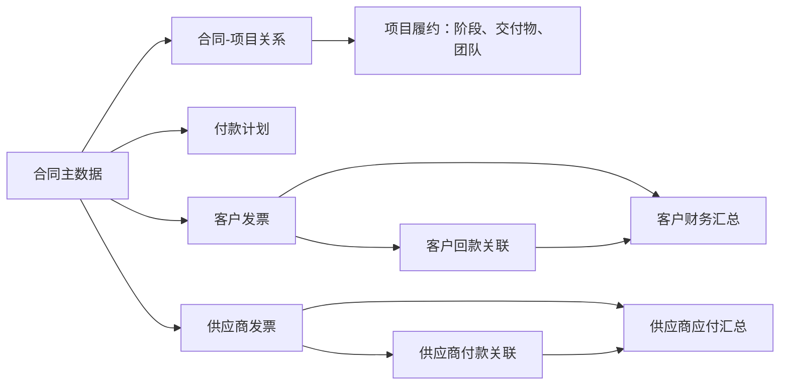
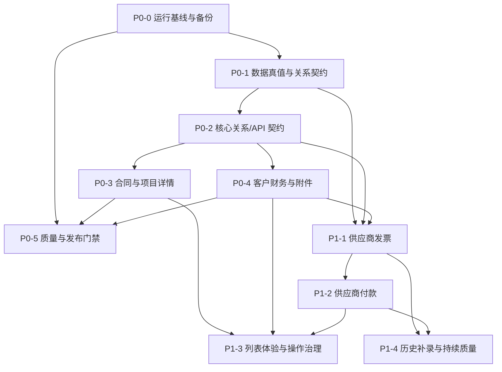

# 核心业务整改主计划（待评审）

> **文档状态：待业务评审，禁止据此直接执行数据写入或生产发布。**  
> **制定日期：2026-07-20**  
> **适用范围：pm-director 本机 Docker 开发测试环境及后续受控发布环境**  
> **依据：2026-07-20 本机运行态只读审计、既有审计整改与阶段 3 重设计文档。**

---

## 0. 文档目的与审批边界

本计划把本轮发现的合同、项目、客户财务、供应商财务、上传、编辑交互、列表视觉与发布验收问题，拆分为可独立交付、可并行协作、可验收回退的整改工作包。

本计划**只定义方案和门禁，不授权以下操作**：

- 不修改 `database/project_management.db` 中的任何业务数据；
- 不执行数据清洗、映射回填、批量导入或迁移；
- 不停止、重启或修改共享基础设施容器；
- 不将未通过验收的代码合并或发布；
- 不因前端展示需要而擅自修改合同金额、付款计划、发票或回款历史。

后续执行必须以“**业务确认 → 备份 → dry-run → 人工复核 → 受控写入 → 回归验收**”为顺序。

---

## 1. 审计基线与整改目标

### 1.1 本轮已确认基线

| 编号 | 审计事实 | 影响 | 整改结论 |
|---|---|---|---|
| B-01 | 同一业务编号的合同、项目、财务记录存在金额口径不一致。`ZH02-202509025` 的合同金额为 `125.085` 万元，项目总合同额为 `12.5085` 万元。 | 合同详情、项目详情、看板与财务列表会展示互相矛盾的数据。 | 先定义金额唯一真值与回填规则，禁止前端自行换算掩盖。 |
| B-02 | 科技类项目付款计划、财务汇总、发票、回款之间存在计划不完整、余额冲突和单位混用风险。 | “付款进度”不可作为可信经营信息。 | 建立付款计划、客户开票、客户回款、供应商应付的分域模型。 |
| B-03 | 合同详情接口返回了含开始/结束日期的阶段数据，但“阶段进度（甘特图）”页面仍为空白。 | 履约核心信息缺失。 | 作为前端渲染/构建一致性 P0 故障处理，不以补数据替代排障。 |
| B-04 | 合同详情当前将“合同条款、保密条款”放在履约、付款、交付物之前。 | 科技类合同信息层级不符合业务优先级。 | 调整为页尾“附加信息”，不得影响条款数据本身。 |
| B-05 | 客户发票“关联回款”、客户回款“关联发票”只切换前端状态，缺少完整选择、提交、回显闭环。 | 用户点击无反应，关联账无法维护。 | 补齐共用关联选择与金额校验能力。 |
| B-06 | 多个编辑、新增按钮为占位或缺少可见表单；合同编辑还出现弹窗空白。 | 页面形成“伪可用”交互。 | 建立操作覆盖清单；未实现能力不得继续显示为可执行。 |
| B-07 | 发票附件上传出现“未知错误”和“内部服务器错误”双提示。 | 附件能力不可用且错误不可定位。 | 统一前后端上传协议、单一错误提示和端到端日志。 |
| B-08 | 供应商发票无有效业务数据，供应商付款为 0 条；现有新增流程依赖手输项目编号。 | 供应商应付链路没有形成可用业务闭环。 | 供应商发票与付款按“供应商 → 合同/项目 → 发票 → 付款”重构。 |
| B-09 | 合同台账、项目台账、供应商、供应商发票、供应商付款列表页存在大面积重复 Hero 横栏。 | 首屏信息密度低、操作区后移、视觉层级混乱。 | 统一为紧凑台账页头；Hero 仅保留在概览类页面。 |
| B-10 | 当前运行的 Docker 前端构建产物、工作区源码与浏览器可见版本仍需建立可核验链路。 | “代码已改、页面未变”无法快速判定根因。 | 发布前必须校验构建指纹、容器静态文件和浏览器版本。 |

### 1.2 总体目标

整改完成后，系统必须达到以下业务与工程结果：

1. **同一合同/项目在所有核心页面展示一致、可追溯的主体和金额口径。**
2. **合同—项目—阶段—客户发票—客户回款—供应商发票—供应商付款形成可解释的关联链。**
3. **所有可见编辑、新增、关联、上传按钮均有真实完成闭环；不能交付的能力明确禁用或隐藏。**
4. **科技类合同可稳定展示阶段甘特图、付款计划、客户财务和附加条款。**
5. **任何涉及业务数据的写入都能回退、审计、复核，不破坏既有合同影像/OCR来源。**
6. **修复结果能在 `http://localhost:18090/web/` 的实际 Docker 页面中被复现和验收。**

### 1.3 本期范围与非范围

**本期范围：**

- 合同与项目详情的主体、金额、关系、阶段、付款、条款、编辑能力；
- 客户发票、客户回款、附件上传与相互关联；
- 供应商发票、供应商付款的业务模型与操作闭环；
- 核心列表页头部体验；
- 数据真值、迁移/清洗流程、测试与发布门禁。

**明确非范围：**

- 不更换 Vue/Vben、FastAPI、SQLite 技术栈；
- 不在本计划阶段重写 CRM、OA、ERP 等无关模块；
- 不把 OCR 原始影像、DOCX 文本层或中间 JSON 当作可直接覆盖的业务数据；
- 不对存在业务歧义的合同、付款计划、回款记录做自动纠错；
- 不把供应商历史数据“伪造补齐”以消除列表空态。

---

## 2. 整改原则与不可违反约束

### 2.1 数据真值与单位原则

| 业务事实 | 临时权威来源（待业务确认后固化） | 单位要求 | 禁止事项 |
|---|---|---|---|
| 合同主数据、合同金额 | `contracts` + 经确认的合同原件/OCR文本 | 合同金额统一明确为“万元”或按新字段明确 | 由项目余额、发票金额反推合同总额 |
| 合同—项目关系 | `contract_project_link` + canonical ID 映射 | 无金额单位 | 仅凭相同名称或前端 query 参数自动认定关联 |
| 项目履约、阶段、交付物 | `projects`、`stages`、`deliverables` | 日期为 ISO 格式；进度为百分比 | 以空页面掩盖缺失数据 |
| 客户开票 | `invoices` 中客户开票方向记录 | `amount_yuan` 或明确“元” | 与客户回款混为同一业务实体 |
| 客户回款 | `receipts` 与发票—回款关系表 | `amount_yuan` 或明确“元” | 仅以发票状态“已回款”替代回款记录 |
| 供应商发票 | 独立供应商发票实体，必须具备供应商与合同/项目关联 | `amount_yuan` 或明确“元” | 写入没有 `supplier_id` 的客户发票数据域 |
| 供应商付款 | 独立供应商付款实体，优先关联供应商发票 | `amount_yuan` 或明确“元” | 只用裸 `project_id` 建付款记录 |
| 财务汇总 | 由明细聚合的只读汇总/视图 | 返回值必须包含或隐含明确单位 | 在多个页面重复维护可编辑汇总字段 |

> **说明：** 上表中的“临时权威来源”不构成业务确认。P0-DATA 完成字段血缘审计后，必须提交正式《数据真值确认单》供业务负责人签字或书面确认。

### 2.2 关联与金额校验原则

- 合同和项目是不同实体；允许一对一或一对多，但必须通过关系表表达，不得假设同 ID 即同实体。
- 一笔客户回款可关联一张或多张客户发票；一张客户发票可被分次回款，但累计关联金额不得超过发票金额。
- 一笔供应商付款可关联一张或多张供应商发票；一张供应商发票可被分次付款，但累计支付不得超过发票可付余额。
- 历史不完整或无法确认的关系必须以 `unverified`/“待核验”状态保存，不能伪造“已匹配”。
- 所有 API、数据库字段、前端列标题和页面数值必须明确金额单位。

### 2.3 安全与基础设施原则

- 数据清洗前必须执行数据库备份，并校验备份文件存在、大小与校验和；
- 所有迁移脚本必须支持 `--dry-run`，输出变更清单、异常清单和可回滚方案；
- 不对共享 MySQL/Redis 容器进行停启、重建或清空；
- 不使用 `docker compose down`、不创建替代共享数据库容器；
- 任何测试、日志、文档都不得输出真实密钥、Cookie、Authorization 内容或用户敏感附件；
- 外部系统导入必须以原始文件、导入批次、解析规则版本和复核人为可追溯元数据。

---

## 3. 目标业务模型与页面信息架构

### 3.1 目标关联链

### 3.2 合同详情目标顺序

1. 合同概览：主体、合同编号、合同金额、签订/履约期限、状态；
2. 履约进度：阶段卡片与甘特图；
3. 付款计划与客户财务：计划、开票、回款、未收/待核验状态；
4. 交付物、团队、关联系统项目；
5. 合同文件与附件；
6. **附加信息：合同条款、保密条款、违约/罚款条款、科研预算等。**

### 3.3 供应商应付操作流

---

## 4. 团队与责任边界

| 团队/工作流 | 核心职责 | 不负责事项 | 主要交付物 |
|---|---|---|---|
| T0：整改统筹与业务确认组 | 维护问题清单、审批节点、跨团队依赖、业务确认单 | 不直接批量清洗数据 | 主计划、确认单、验收签字记录 |
| T1：数据治理与财务真值组 | 字段血缘、单位、关系规则、数据质量报告、迁移 dry-run | 不直接做页面视觉修饰 | 数据字典、清洗候选清单、迁移/回滚脚本 |
| T2：核心后端与关系服务组 | 合同/项目/发票/回款/附件/供应商 API、校验规则 | 不独立决定业务金额真值 | API 契约、后端测试、错误码规范 |
| T3：合同与项目体验组 | 合同/项目详情、甘特图、编辑、新增、条款布局、返回契约 | 不修改未经批准的数据 | 页面、组件测试、浏览器验收截图 |
| T4：客户财务与附件体验组 | 客户发票、客户回款、关联选择、附件上传操作 | 不重构供应商应付模型 | 发票/回款前端闭环、上传体验 |
| T5：供应商财务产品组 | 供应商发票、供应商付款、自动补全、应付余额、凭证上传 | 不擅自迁移历史财务数据 | 供应商应付闭环与测试 |
| T6：质量、发布与回归组 | CI、构建指纹、Docker 验收、Playwright、回归证据 | 不绕过门禁直接发布 | 测试矩阵、发布记录、回滚验证 |

> 团队可由不同开发小组或 Agent 承担；每个工作包只能有一个最终责任团队。跨组改动必须以 API 契约和测试样例对接，避免多个团队同时改同一数据写入逻辑。

---

## 5. P0 工作包：上线前必须关闭

### P0-0：运行基线、备份与发布可追溯

| 项目 | 内容 |
|---|---|
| 责任团队 | T0 + T6 |
| 目标 | 固定本机 Docker、源码、构建产物、浏览器版本的对应关系；为后续数据工作建立可恢复点。 |
| 涉及范围 | `docker-compose.yml`、`nginx.conf`、前端构建流程、`.github/workflows/`、`scripts/backup-database.sh`、新增验证脚本。 |
| 主要动作 | 记录 Git SHA/分支、前端构建时间和 hash、容器内 `index.html`/资产 hash、后端 `/ready` 版本信息；执行备份演练；建立本机发布验收记录模板。 |
| 前置依赖 | 无。 |
| 后续依赖 | 所有 P0 数据写入和浏览器验收。 |
| 禁止 | 不使用 `docker compose down`；不对共享容器操作；不把业务数据库备份提交到 Git。 |
| 完成条件 | 每次部署能回答“浏览器页面来自哪个提交、哪个构建、哪个容器挂载”；备份可校验存在。 |

### P0-1：数据真值、金额单位与关系契约

| 项目 | 内容 |
|---|---|
| 责任团队 | T1（T2 提供 API 影响评估） |
| 目标 | 建立合同、项目、客户发票、客户回款、供应商发票、供应商付款的唯一真值与字段血缘。 |
| 涉及数据/脚本 | `database/project_management.db`（只读审计阶段）、`backend/database.py`、`scripts/import_finance_excel.py`、`scripts/import_finance_v2.py`、`scripts/import_to_db.py`、`scripts/migrate_v3.py`、新增审计/迁移脚本。 |
| 主要动作 | 输出字段字典；核查同 ID 合同/项目金额差异；统计付款计划合计与合同额差异；识别客户回款被写入发票域的记录；识别供应商数据缺口；设计 canonical ID 与映射审核状态。 |
| 前置依赖 | P0-0 数据库备份与版本基线。 |
| 后续依赖 | P0-2、P0-3、P0-4、P1-1、P1-2。 |
| 业务确认点 | 合同 canonical ID；金额单位；`finance_records` 的权威性；历史客户回款转换规则；供应商历史数据来源。 |
| 完成条件 | 《数据真值确认单》获批；提供 dry-run 报告、逐条候选变更、拒绝/待确认清单和回滚方案。 |

### P0-2：核心关系服务与财务 API 契约

| 项目 | 内容 |
|---|---|
| 责任团队 | T2 |
| 目标 | 让所有详情页和列表页通过同一关系规则读取数据，防止合同、项目、财务各自拼接。 |
| 涉及后端文件 | `backend/routers/contracts.py`、`backend/routers/projects.py`、`backend/routers/invoices.py`、`backend/routers/receipts.py`、`backend/routers/suppliers.py`、`backend/models.py`、`backend/database.py`、对应测试文件。 |
| 目标接口范围 | 合同详情、项目详情、阶段、付款计划、客户发票、客户回款、发票—回款关系、附件、供应商发票、供应商付款、联想搜索。 |
| 主要动作 | 定义统一 DTO：`contract_id`、`project_ids`、关系状态、金额单位、来源、核验状态；定义关联写入的幂等性与上限校验；接口错误使用可识别的业务错误码/消息；附件上传返回单一结构化错误。 |
| 前置依赖 | P0-1 的数据真值规则；P0-0 的测试环境基线。 |
| 后续依赖 | P0-3、P0-4、P1-1、P1-2。 |
| 禁止 | 不以 `LIMIT 1` 随机挑选冲突财务记录作为永久规则；不继续让前端按不同页面自行计算余额。 |
| 完成条件 | OpenAPI/类型定义、契约测试和异常测试齐全；同一合同在合同/项目详情 API 返回可解释且可对账的关联集合。 |

### P0-3：合同与项目详情真实闭环

| 项目 | 内容 |
|---|---|
| 责任团队 | T3 |
| 目标 | 修复合同/项目详情不一致、甘特图空白、条款层级错误、编辑空白/无效及返回上下文丢失。 |
| 涉及前端文件 | `ui-vben/apps/web-antd/src/views/contracts/detail.vue`、`views/contracts/components/stage-gantt.vue`、`views/contracts/components/detail/*`、`views/projects/detail.vue`、`views/projects/index.vue`、`src/api/contracts.ts`、`src/api/projects.ts`、`src/utils/business-navigation*`、相关 Vitest/Playwright 测试。 |
| 主要动作 | 接入 P0-2 DTO；修复 ECharts 生命周期/容器尺寸/数据降级；将条款和保密信息移至末尾；补齐合同与项目编辑加载、保存、刷新；审计详情页所有按钮；实现来源参数的返回契约。 |
| 前置依赖 | P0-2；甘特图可在 P0-2 契约冻结后先行修复渲染。 |
| 后续依赖 | P1-3 台账视觉统一；T6 全量浏览器验收。 |
| 完成条件 | 指定科技合同和至少两类其他合同均可显示阶段；合同/项目间主体、关系、金额来源可解释；编辑保存后刷新一致；无“按钮无反应”。 |

### P0-4：客户发票、回款与附件可靠闭环

| 项目 | 内容 |
|---|---|
| 责任团队 | T2 + T4（T2 负责 API/校验，T4 负责页面闭环） |
| 目标 | 修复发票—回款关联和附件上传，使客户财务页面可真实维护。 |
| 涉及后端文件 | `backend/routers/invoices.py`、`backend/routers/receipts.py`、附件存储/元数据表、对应测试。 |
| 涉及前端文件 | `views/customer-finance/invoices/*`、`views/customer-finance/receipts/*`、`src/api/invoices.ts`、`src/api/receipts.ts`、公共上传/错误处理组件。 |
| 主要动作 | 实现“关联回款/关联发票”检索选择弹窗、部分金额输入、余额上限校验、关联后回显和取消关联；发票详情突出合同关联，项目只作为上下文；统一上传前校验、进度、成功刷新、下载、单一错误提示。 |
| 前置依赖 | P0-2；P0-1 对金额单位和历史记录规则的确认。 |
| 后续依赖 | P1-1、P1-2 复用附件和关联模式。 |
| 完成条件 | 发票↔回款关联的新增、取消、刷新持久化可验证；上传成功可下载，失败只展示一个明确错误且日志可追踪。 |

### P0-5：质量门禁、回归测试与受控发布

| 项目 | 内容 |
|---|---|
| 责任团队 | T6（各实现团队补齐其单元/契约测试） |
| 目标 | 防止“源码修了、Docker 未更新”“页面存在但按钮不可用”“数据修复无证据”等回归。 |
| 涉及范围 | `.github/workflows/`、`ui-vben/apps/web-antd` 测试、`backend/tests/`、`scripts/verify-*`、新增 Playwright 契约/视觉测试。 |
| 主要动作 | 将前端 lint/typecheck/unit/build 纳入必过检查；加入 API 契约、数据完整性、迁移 dry-run、路由返回、上传、关联、甘特图测试；记录 Docker 部署证据；设置阻断性 PR 门禁。 |
| 前置依赖 | P0-0；各功能包产出。 |
| 后续依赖 | 所有 P1 工作包的合并与发布。 |
| 完成条件 | P0 验收矩阵全部通过；失败 PR 不能合并；部署后实际浏览器、API、构建指纹三者一致。 |

---

## 6. P1 工作包：在 P0 基线稳定后交付

### P1-1：供应商发票业务闭环重构

| 项目 | 内容 |
|---|---|
| 责任团队 | T2 + T5 |
| 目标 | 让供应商发票成为带供应商、合同/项目、金额、附件和核验状态的独立业务对象。 |
| 涉及范围 | `backend/routers/suppliers.py` 或拆分后的供应商财务路由、供应商发票数据表/迁移、`views/supplier-finance/invoices/*`、`src/api/suppliers*`、联想搜索接口。 |
| 主要动作 | 新增供应商优先选择；合同编号/合同名称/项目名称自动补全；自动带入合同、项目和应付摘要；录入发票编号、税率、金额、日期、状态；上传发票文件；列表支持待核验/待付款/部分付款/已结清。 |
| 前置依赖 | P0-1、P0-2、P0-4 的附件规范。 |
| 完成条件 | 不再要求用户手输裸项目编号；新增供应商发票后可在详情、列表、供应商页和应付汇总中一致看到。 |

### P1-2：供应商付款业务闭环重构

| 项目 | 内容 |
|---|---|
| 责任团队 | T2 + T5 |
| 目标 | 基于供应商发票建立可部分付款、可拆分关联、可上传付款凭证的应付流程。 |
| 涉及范围 | 供应商付款表/关系表/迁移、供应商付款 API、`views/supplier-finance/payments/*`、供应商详情页付款入口。 |
| 主要动作 | 选择供应商后仅展示该供应商未结清发票；支持单笔付款分配给多张发票；自动计算可付上限、已付、待付；上传付款凭证；详情可追溯到发票、合同与项目。 |
| 前置依赖 | P1-1；P0-2 关系校验能力；P0-4 附件能力。 |
| 完成条件 | 任一供应商发票的累计付款不可超过发票金额；付款状态与应付汇总实时一致；详情页无占位“开发中”按钮。 |

### P1-3：台账列表体验与操作覆盖治理

| 项目 | 内容 |
|---|---|
| 责任团队 | T3 + T4 + T5 |
| 目标 | 移除台账页面重复 Hero 横栏，统一紧凑页头；清除所有“假按钮”。 |
| 涉及范围 | 合同、项目、供应商、供应商发票、供应商付款列表及详情页；公共布局/操作组件。 |
| 主要动作 | 建立统一 `LedgerPageHeader` 或等价轻量组件；展示标题、关键摘要、主操作、筛选区；扫描并处理所有占位 handler、空回调、不可提交弹窗；保留“未实现”时明确禁用或隐藏。 |
| 前置依赖 | P0-3、P0-4、P1-1、P1-2 的真实操作能力。 |
| 完成条件 | 五类台账首屏不再出现大 Hero；操作清单中每个按钮均有“完成/禁用/隐藏”三态之一。 |

### P1-4：历史数据补录与持续数据质量机制

| 项目 | 内容 |
|---|---|
| 责任团队 | T0 + T1 |
| 目标 | 在业务确认后逐批恢复供应商历史发票、付款及待确认财务关系，并防止再次污染。 |
| 涉及范围 | 外部表格/合同原件/OCR文本、导入脚本、数据质量报表、知识库案例。 |
| 主要动作 | 按批次导入；保留原始来源、导入批次、规则版本、复核人；将不可确认记录放入待核验队列；按周输出数据质量报表。 |
| 前置依赖 | P0-1、P1-1、P1-2；业务审批。 |
| 完成条件 | 每批变更均有来源、备份、dry-run、复核、回滚和验收记录；待确认数据不会被误标为已核验。 |

---

## 7. 文件、接口与写入边界清单

### 7.1 后端责任边界

| 领域 | 主要文件/模块 | 允许的整改方向 |
|---|---|---|
| 合同 | `backend/routers/contracts.py` | 合同详情 DTO、关系读取、阶段/付款/文件契约、合同编辑校验。 |
| 项目 | `backend/routers/projects.py` | 项目详情 DTO、关联合同、阶段/付款读取、项目编辑校验。 |
| 客户发票 | `backend/routers/invoices.py` | 发票详情、附件、客户回款关联、合同上下文、错误码。 |
| 客户回款 | `backend/routers/receipts.py` | 回款详情、发票关联、部分金额、取消关联、状态回算。 |
| 供应商 | `backend/routers/suppliers.py` 或独立供应商财务路由 | 供应商发票、付款、联想搜索、应付余额与附件。 |
| 数据库 | `backend/database.py`、迁移脚本 | 只在批准后增加明确约束、索引、表结构和迁移；禁止运行时隐式建业务表。 |

### 7.2 前端责任边界

| 领域 | 主要文件/模块 | 允许的整改方向 |
|---|---|---|
| 合同详情 | `views/contracts/detail.vue`、`components/detail/*`、`stage-gantt.vue` | 信息排序、甘特图、编辑、关联展示、文件上传、错误空态。 |
| 项目详情 | `views/projects/detail.vue` | 合同关系、履约和财务展示、编辑/新增操作、返回契约。 |
| 客户财务 | `views/customer-finance/invoices/*`、`receipts/*` | 发票—回款关联、合同上下文、附件上传、编辑。 |
| 供应商财务 | `views/supplier-finance/invoices/*`、`payments/*` | 自动补全、发票/付款闭环、凭证上传、详情追溯。 |
| API 类型 | `src/api/contracts.ts`、`projects.ts`、`invoices.ts`、`receipts.ts`、供应商 API 文件 | DTO 类型、金额单位、状态、错误处理。 |
| 路由/返回 | `backend/routers/auth.py`、前端业务导航工具 | 后端菜单唯一真值、来源参数保留、旧路径仅单向迁移。 |

### 7.3 数据写入红线

以下操作必须在 P0-1 业务确认、备份、dry-run 和审批后才可执行：

- 修正项目总合同额；
- 修改合同 canonical ID 或映射；
- 回填/删除付款计划；
- 迁移客户回款、发票关联；
- 导入供应商发票、供应商付款；
- 启用或补充外键约束；
- 任何批量 `UPDATE`、`DELETE`、`INSERT`、导入脚本。

---

## 8. 依赖关系与建议实施顺序

### 建议并行策略

- **第一并行组：** P0-0 与 P0-1 可同时开始，但 P0-1 只允许只读审计和 dry-run 设计；
- **第二并行组：** P0-2 的 API 契约草案可与 P0-1 的业务确认准备并行，正式实现必须等待真值确认；
- **第三并行组：** P0-3 的甘特图渲染诊断、P0-4 的上传链路诊断可并行，但不得接入未冻结的财务计算规则；
- **第四并行组：** P1-1/P1-2 仅在供应商数据模型和客户附件规范稳定后启动；
- **收口：** P0-5 贯穿全程，但仅在所有 P0 验收通过后开放 P1 发布。

---

## 9. 验收矩阵

### 9.1 P0 业务验收案例

| 编号 | 验收场景 | 操作 | 预期结果 | 证据 |
|---|---|---|---|---|
| AC-01 | 合同/项目一致性 | 打开同一业务编号的合同详情与项目详情 | 主体、关联关系、合同金额、单位、核验状态一致或明确说明差异来源 | API 响应、数据库核对、浏览器截图 |
| AC-02 | 科技合同甘特图 | 打开至少 3 个含阶段日期的科技合同 | 甘特图可见且与阶段列表日期一致；无日期时出现明确降级提示 | 浏览器截图、控制台无错误、接口样本 |
| AC-03 | 付款计划可信性 | 打开科技类、服务类各至少 3 个合同 | 显示计划、实收、待收、单位、来源/核验状态；异常数据不伪装成正常 | API、人工对账表、截图 |
| AC-04 | 条款层级 | 打开科技合同详情 | 合同条款/保密条款位于页尾附加信息区 | 浏览器截图 |
| AC-05 | 合同编辑 | 点击编辑、修改允许字段、保存、刷新 | 表单已预填；保存后数据一致；失败有明确错误 | 请求记录、刷新截图 |
| AC-06 | 项目编辑/新增 | 对每个可见项目操作按钮执行一次 | 均可完成或明确禁用/隐藏，不存在无反应 | 按钮清单、Playwright 记录 |
| AC-07 | 发票关联回款 | 在客户发票详情选择同合同可用回款并输入部分金额 | 保存后双方详情都回显，余额正确，超额被拦截 | API、两端截图、数据库关联记录 |
| AC-08 | 回款关联发票 | 在客户回款详情选择一张或多张发票 | 保存、取消、刷新均正确 | API、截图、关联记录 |
| AC-09 | 发票附件上传 | 上传合法测试文件、下载；再上传非法/超限文件 | 成功可见可下载；失败只有一个明确提示且服务端可定位 | 网络日志、后端日志摘要、截图 |
| AC-10 | 列表页头部 | 合同、项目、供应商、供应商发票、供应商付款列表 | 无重复大 Hero；标题、主操作、筛选首屏清晰 | 1440/1024/768/390 截图 |

### 9.2 P1 业务验收案例

| 编号 | 验收场景 | 操作 | 预期结果 | 证据 |
|---|---|---|---|---|
| AC-11 | 新增供应商发票 | 选择供应商，输入合同/项目关键词，选择匹配项，上传附件后保存 | 自动带入关联信息；不允许裸项目编号盲填；发票出现在供应商与合同上下文 | 截图、API、数据库记录 |
| AC-12 | 新增供应商付款 | 选择供应商发票，输入部分付款，上传凭证后保存 | 不可超付；已付/待付更新；可从付款追溯发票、合同、项目 | 截图、API、余额核对 |
| AC-13 | 供应商拆分付款 | 一笔付款关联多张发票或一张发票分次付款 | 累计关系与总额正确，撤销/更改有校验 | 关联明细、对账结果 |
| AC-14 | 历史补录批次 | 导入一批经确认历史数据 | 每条有来源、批次、规则版本、复核人；异常进入待核验队列 | dry-run、导入报告、回滚验证 |

### 9.3 自动化回归最低要求

- 后端：单元测试、接口契约测试、关联上限/幂等性/错误码测试；
- 前端：类型检查、组件测试、关键状态和错误态测试；
- 浏览器：Playwright 覆盖上述 AC-01 至 AC-13 的主路径；
- 运行时：采集 `console error`、`pageerror`、`requestfailed`、HTTP 4xx/5xx；
- 数据：迁移 dry-run、备份校验、迁移后统计、抽样人工对账；
- 视觉：1440、1024、768、390 四个宽度的关键页面截图对比。

---

## 10. 发布门禁与回滚要求

### Gate 0：方案与业务确认门禁

以下事项未确认，禁止开始数据写入型开发：

- 合同 canonical ID 和映射审批规则；
- 合同金额、项目总合同额、开票、回款、付款计划的单位和真值来源；
- `finance_records` / `current_finance_view` 是否可作为当前财务权威来源；
- 历史“客户回款”类发票的迁移/保留策略；
- 供应商历史发票、付款的来源和补录优先级；
- 允许自动修复与必须人工确认的数据范围。

### Gate 1：数据安全门禁

- 已完成数据库备份并记录校验和；
- 迁移只允许先跑 `--dry-run`；
- dry-run 输出候选变更、异常、拒绝原因和回滚步骤；
- 业务负责人对清洗清单逐批确认；
- 写入后执行记录数、金额汇总、关系完整性和抽样合同对账。

### Gate 2：代码与 PR 门禁

- 一个 PR 只覆盖一个工作包或同一 API 契约的紧密变更；
- 前端路由/组件改动必须遵循 Vben 规则和后端菜单唯一真值；
- 数据库迁移必须包含测试、dry-run 和回滚文档；
- 必须通过：后端 lint/test、前端 lint/typecheck/unit/build、相关 Playwright、数据完整性检查；
- 不允许以“CI 仍在运行”或“本地看过”作为合并依据；
- 所有评论、失败检查、业务确认项关闭后才能合并。

### Gate 3：本机 Docker 发布门禁

- 记录部署 Git SHA；
- 前端 `dist` 构建完成且容器挂载路径、`index.html` 和关键资产 hash 可核验；
- 后端 `/ready` 可用；
- 使用真实浏览器访问 `http://localhost:18090/web/` 完成 P0 烟测；
- 页面、API 与容器日志无未解释的 4xx/5xx、`pageerror`、`requestfailed`。

### Gate 4：业务验收与回滚门禁

- AC-01 至 AC-10 全部通过才可宣布 P0 完成；
- AC-11 至 AC-14 完成后才可宣布供应商应付模块上线；
- 发现金额、关系、附件丢失或超额关联时，立即停止后续批次，按变更批次回滚；
- 发布后保留发布前数据库备份、迁移报告和验收截图，不得覆盖。

---

## 11. 评审需要明确的业务决策

请业务评审重点确认下列问题；这些问题决定数据修复能否安全启动：

1. **合同与项目的业务关系：** 是否允许一份合同对应多个项目？是否允许一个项目归属多个合同？
2. **金额单位：** 合同、项目、财务汇总、付款计划、客户发票/回款、供应商发票/付款分别使用“元”还是“万元”？是否允许数据库旧字段保留但 API 统一换名？
3. **财务权威来源：** 当前 `finance_records`、`current_finance_view`、客户发票、客户回款哪个是历史基准，哪个是派生汇总？
4. **付款计划口径：** 计划付款、客户开票、客户回款、供应商付款是否允许混在同一“付款进度”区块？建议拆分展示，是否确认？
5. **历史回款处理：** 目前被导入为“客户回款”类型发票的记录，是保留为历史痕迹、迁移为 `receipts`，还是双向只读兼容？
6. **供应商财务补录：** 历史供应商发票和付款的可信来源是什么？是否先只开放新增，历史数据后续分批补录？
7. **数据清洗授权：** 哪类异常允许自动修复，哪类必须人工逐条确认？
8. **上线策略：** 是否同意先完成 P0 客户侧/合同侧闭环，再发布 P1 供应商财务，而不是一次性大版本切换？

---

## 12. 评审后的启动条件与首批交付物

### 12.1 评审通过后的第一批交付物

1. 《数据真值确认单》；
2. 《P0-0 运行基线与备份验收记录》；
3. 《P0-1 数据字段血缘与清洗 dry-run 报告》；
4. 合同/项目/客户财务 API 契约草案；
5. 供应商发票与供应商付款的交互原型/字段清单；
6. P0 自动化验收矩阵与发布门禁配置清单。

### 12.2 当前结论

- 本计划建议**先批准 P0-0 和 P0-1 的只读/设计工作**；
- P0-2 至 P1-4 的代码与数据写入工作，必须在第 11 节业务决策确认后排期；
- 未通过评审前，本计划不应被视为数据修复授权或上线授权。

---

## 13. 计划维护说明

- 本文是整改主计划，后续每个工作包应创建独立 Issue/RFC、分支、PR 和验收记录；
- 任何改变数据真值、金额单位、关系规则或上线范围的决定，都必须回写本文的“修订记录”并更新对应 API/数据字典；
- 实施过程中发现的新数据异常应进入数据质量清单，不允许临时在页面层“特判修复”；
- 任务完成后应沉淀可复用的迁移、验收和发布经验至项目知识库，并更新索引。

### 修订记录

| 日期 | 版本 | 说明 | 状态 |
|---|---|---|---|
| 2026-07-20 | v1.0 | 基于本机 Docker 运行态只读审计形成首版整改主计划 | 待业务评审 |
