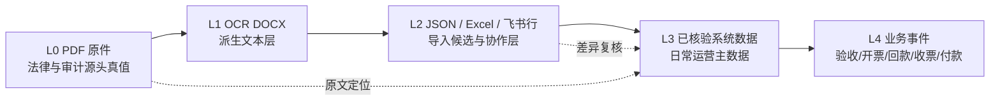
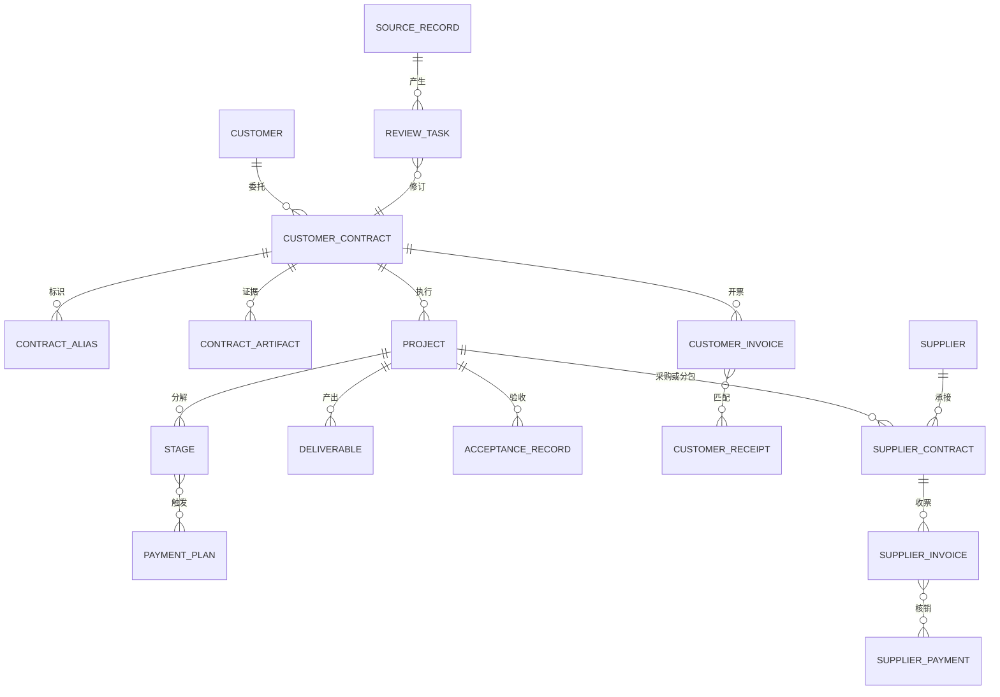

# 阶段3：业务模型与数据血缘基线

> 日期：2026-07-15
> 状态：阶段3重设计基线
> 范围：合同、项目履约、客户应收、供应商应付、来源核验
> 原则：本文件只定义可由现有文档、代码和数据库复核的事实；推断和未来目标单独标注。

## 一、结论

当前系统不是成熟经营驾驶舱，而是从合同原件和低质量表格向结构化系统管理过渡的数据治理与业务协作系统。阶段3应先建设“合同档案与数据核验工作台”，再由已核验的合同约定驱动项目履约、客户应收和供应商应付。

客户资金链与供应商资金链方向相反，必须分开：

```text
客户侧：国网客户合同 → 阶段/交付物 → 验收/考核 → 销项发票 → 客户回款 → 质保金回款
供应侧：项目/客户合同 → 供应商合同 → 供应商交付/验收 → 进项发票 → 付款审批 → 供应商付款
```

二者只通过项目、采购/分包合同和业务事件关联，不能复用一条通用履约时间线。

## 二、当前数据快照

数据来源：`database/project_management.db`，2026-07-15 只读聚合。数字是评审快照，不是实时承诺。

| 对象 | 数量 | 业务含义 |
|------|----:|----------|
| 合同 | 45 | 服务类 32、科研类 10、未分类 3 |
| 项目 | 50 | 与合同尚非严格 1:1 |
| 合同—项目关系 | 45 | 当前骨架已存在 |
| 合同类型属性 | 29 | 服务 18、科研 8、物资 3 |
| 阶段 | 46 | 34 个合同仍没有阶段记录 |
| 合同付款计划 | 84 | 只有 1 条存在实际金额，不能当作回款表 |
| 交付物 | 71 | 27 个合同仍没有交付物 |
| 发票混合表 | 87 | 53 条客户开票；34 条历史客户回款 |
| 独立客户回款 | 34 | 其中 25 条参与发票匹配 |
| 发票—回款匹配 | 25 | 仅覆盖 23 张发票、25 笔回款 |
| 供应商 | 55 | 主档数量不等于已形成交易闭环 |
| 供应商关系 | 23 | 覆盖 22 个上游合同、23 家供应商 |
| 供应商付款 | 0 | 当前尚无真实应付闭环 |
| 阶段—付款关联 | 0 | 当前不存在可靠 FK 关系 |

### 关键冲突

`invoices.direction='inbound'` 的 34 条记录实际是旧脚本导入的“客户回款”，但旧供应商财务设计又把 inbound 定义为“供应商给我司开票”。因此：

1. 不能把当前 inbound 数据展示成供应商发票。
2. `direction` 只能描述发票方向，不能承载回款事件。
3. 客户回款应归一到 `receipts`。
4. 供应商收票和付款必须建立独立、可追溯的领域对象。
5. 历史数据迁移前，页面必须显示“语义待迁移”，不能显示“已核验”。

## 三、合同分类必须使用双轴

| 分类轴 | 示例 | 作用 |
|--------|------|------|
| 法律/交易形式 | 技术服务合同、产品购销合同、采购/分包合同 | 决定主体、权利义务、税务和条款结构 |
| 项目执行形态 | 科研、常规技术服务、物资；施工/框架为未来扩展 | 决定阶段、交付物、验收和付款触发方式 |

“技术服务合同”与“科研项目”可以同时成立，不能互相覆盖。

### 科研类

- 通常 1–3 年。
- 研究方案、论文、专利、软著、报告、专家评审等是核心成果。
- 阶段与付款可为 1:1、N:1 或少量 1:N。
- 多阶段合并触发一笔付款时，不得按数组顺序硬配。

### 服务类

- 以服务范围、工期、交付资料、验收标准和质量要求为核心。
- 付款常由“完成工作 + 资料提交 + 验收 + 发票 + 约定工作日”组合触发。
- 常见但非统一的付款模式包括 97%+3%、80%+17%+3%、80%+20%、50%+50%。

### 条款与质保金

- 97%+3% 是强业务候选规则，不是全局默认值。
- 合同原文为 100%、业务解释为 97%+3% 时，必须同时保存原文、修正规则、修正人、修正时间和核验状态。
- 违约、赔偿、保密、知识产权、违约金、逾期和解除/终止需要结构化，同时保留原文定位。

## 四、编号模型

当前并行存在：

- 内部编号：`ZH02-*`。
- 国网正式编号：`SGSC*`。
- 财务编号：当前主表尚未结构化。

2026-07-15 快照为 39 个 ZH 主键、6 个 SGSC 主键、29 条 `sgsc_id`、32 条映射、0 条 `financial_id`。

目标不应是“覆盖成一个编号”，而应是“统一业务主键 + 多别名”：

| 字段 | 说明 |
|------|------|
| canonical_id | 系统稳定主键 |
| alias_type | internal / state_grid / finance / historical |
| raw_value | OCR 或表格中的原值 |
| normalized_value | 归一化值 |
| source_artifact_id | 来源文件或表格行 |
| verification_status | raw / parsed / needs_review / verified / rejected |
| verified_by / verified_at | 人工核验留痕 |

## 五、数据来源五层模型



### 每个导入字段必须携带

- 来源文件、版本、页码/段落/单元格位置。
- 抽取方式和置信度。
- 原值、规范化值和当前采用值。
- 核验状态、核验人和核验时间。
- 被替代关系与操作审计。

### 低质量表格的处理边界

- “完结”“已开完”是状态，不等于真实明细。
- 汇总行和明细行必须同时保留并做差异校验。
- 元/万元、日期格式和三套编号必须显式归一。
- 名称匹配只能生成候选，不能自动形成事实关联。
- 使用合同额或已开票额补齐“完结”时必须标为推断值。

## 六、领域关系



## 七、当前页面必须呈现的可信度

| 状态 | 页面表现 | 禁止表现 |
|------|----------|----------|
| 已核验 | 绿色文字标签 + 来源 + 核验人/时间 | 只显示“已核验”无证据 |
| 待核验 | 琥珀标签 + 待办入口 | 当作 0 或正常值 |
| 推断 | 蓝灰标签 + 推断规则 | 冒充合同原文 |
| 冲突 | 红色细边 + 候选值对比 | 静默选一个值 |
| 缺失 | 空值 + 补充动作 | 用 `0`、`—` 混淆业务含义 |
| 历史快照 | 数据时点 + 批次 | 显示“实时” |

## 八、数据成熟度路线

1. **文档/表格主导期（当前）**：建设导入、差异和核验中心，原文件只追加、不覆盖。
2. **系统与表格并行期**：已核验合同、阶段和真实财务事件进入系统；外部表格只生成差异任务。
3. **系统主导期**：新业务事件从系统产生；表格退化为兼容导入和导出报表。
4. **多端协作期**：小程序/App 负责现场证据和轻审批，Web 负责复杂治理；PDF 始终保留法律真值地位。

## 九、后端改造边界

P0：迁移历史客户回款语义，停止把 inbound 直接当供应商发票。
P0：建立统一来源、核验、版本和数据问题模型。
P1：建立阶段—付款、发票—回款、供应商发票—付款的显式关联。
P1：统一 canonical ID 和别名模型。
P2：建设移动上传会话、幂等、同步游标与通知订阅。

数据库清洗、删除、金额单位修正均属于业务确认红线，本阶段只设计、不执行。

## 十、证据来源

- `docs/深度需求分析与架构设计-v2.md`
- `docs/合同识别规则库-科研与服务类项目专项.md`
- `docs/数据补全-合同条款调研与规律总结-20260709.md`
- `docs/财务数据提取与处理规范-完整版.md`
- `docs/23个无付款合同深度分析报告.md`
- `docs/合同详情页审计报告-20260711.md`
- `docs/合同详情页整体改造方案-20260711.md`
- `database/project_management.db` 只读聚合
