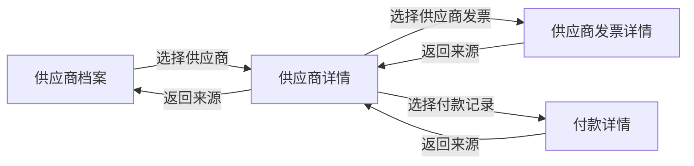

# 阶段 3 核心任务流与低保真原型

> 日期：2026-07-15
>
> 状态：设计基线 v0.1
> 前置文档：[阶段 3 信息架构与规范路由](./阶段3-信息架构与规范路由-20260715.md)

## 1. 主要用户任务

主要用户是项目总监、项目经理和财务人员。
系统的单一工作目标是帮助他们判断下一步要处理什么，并在合同、项目、发票、回款、供应商和付款之间移动时不丢失上下文。

阶段 3 优先覆盖三个端到端任务：

1. 从驾驶舱发现履约问题，进入合同和项目详情，再返回原列表。
2. 从客户应收发现逾期或未匹配款项，核对发票与回款，再返回原筛选。
3. 从供应商档案核对发票和付款，再返回供应商上下文。

## 2. 导航上下文契约

所有列表和详情页使用同一套上下文规则：

1. 列表把筛选、页码和排序写入 URL Query。
2. 列表进入详情时传递安全的内部 `from` 路径。
3. 详情进入关联对象时，把当前详情的规范完整路径作为新的 `from`。
4. 返回时优先使用可信的 `from`，其次使用浏览器历史，最后回到模块规范列表。
5. `from` 只接受当前站点内的规范业务路径，禁止外部地址和旧路径。
6. 列表滚动位置使用 `route.fullPath` 作为键保存在会话级存储中。
7. 页面刷新后至少恢复筛选、页码和排序；滚动恢复是增强项，不阻塞基础任务。

```text
列表 URL Query
  └─ status=active&page=2&sort=amount_desc
       └─ 详情 from=/delivery/contracts?status=active&page=2...
            └─ 项目详情 from=/delivery/contracts/detail?id=...
```

## 3. 主流程：驾驶舱到合同和项目


### 3.1 成功条件

- 驾驶舱行动项进入列表后，筛选条件可见且可清除。
- 合同和项目名称都是显式链接，键盘可达。
- 项目详情返回合同详情，不跳到隐藏项目列表。
- 合同详情返回原筛选、页码和排序。
- 任何一步刷新后都不会落入旧页面或 404。

### 3.2 当前流程与目标流程对比

```text
当前
顶部菜单 + 左侧菜单 + 标签栏
  → 看板卡片可能执行两次跳转
  → 合同详情
  → 项目详情
  → 固定返回隐藏 ProjectList

目标
单侧栏
  → 驾驶舱行动项（明确筛选条件）
  → 合同台账
  → 合同详情
  → 项目详情
  → 按来源逐级返回
```

## 4. 次流程：客户发票到回款


### 4.1 成功条件

- 金额在所有页面使用同一单位和精度。
- 发票详情不再返回旧 `InvoiceList`。
- 未匹配回款明确显示“未匹配”和核验时间，不显示为 0。
- 删除或状态变更后的返回目标仍是规范列表和原筛选。

## 5. 次流程：供应商到发票和付款



### 5.1 成功条件

- 供应商详情页把资料、发票和付款组织为同一履约上下文。
- “综合评级”只有在展示算法、数据时点和适用范围后才能出现。
- “查看全部”必须有真实目标，否则删除该控件。
- 返回过程中不经过旧供应商页或 `/suppliers//suppliers`。

## 6. 全局壳层低保真原型

```text
┌──────────────────────────────────────────────────────────────────────────┐
│ PM Director                    搜索  刷新  主题  帮助  用户               │
├──────────────────┬───────────────────────────────────────────────────────┤
│ 驾驶舱           │ 面包屑                                                │
│                  │ 页面标题                           页面级主要操作       │
│ 合同履约         │ 说明 / 数据时间 / 单位                                │
│   合同台账       ├───────────────────────────────────────────────────────┤
│   项目执行       │                                                       │
│                  │ 业务内容                                               │
│ 客户应收         │                                                       │
│   发票台账       │                                                       │
│   回款记录       │                                                       │
│                  │                                                       │
│ 供应商履约       │                                                       │
│   供应商档案     │                                                       │
│   供应商发票     │                                                       │
│   付款记录       │                                                       │
└──────────────────┴───────────────────────────────────────────────────────┘
```

顶栏不出现一级业务菜单。
全局标签栏关闭。
移动端侧栏变为抽屉，内容顺序不变。

## 7. 驾驶舱低保真原型

```text
┌──────────────────────────────────────────────────────────────────────────┐
│ 经营驾驶舱       数据更新 2026-07-15 10:00   单位：万元      [刷新]       │
│ [全局总览] [经营管理] [项目执行] [财务回款]                              │
├──────────────────────────────────────────────────────────────────────────┤
│ 下一步行动                                                               │
│ 高风险项目 3      逾期回款 2      待交付成果 12      未匹配回款 5        │
│ 每项都说明口径、数据时点和目标列表筛选                                   │
├───────────────────────────┬──────────────────────────────────────────────┤
│ 关键指标                  │ 结构或趋势                                   │
│ 合同额 / 开票 / 回款      │ 只加载当前视图需要的图表                     │
├───────────────────────────┴──────────────────────────────────────────────┤
│ 最近变化或当前视图的重点对象列表                                         │
└──────────────────────────────────────────────────────────────────────────┘
```

“下一步行动”优先于大数字和图表。
驾驶舱的每个可点击项都必须是语义化链接或按钮，不能用普通 `div` 模拟。

## 8. 列表页低保真原型

```text
┌──────────────────────────────────────────────────────────────────────────┐
│ 合同台账                                            [新增合同] [导出]     │
│ 查询、核对和进入合同履约详情                                             │
├──────────────────────────────────────────────────────────────────────────┤
│ 关键词 [              ] 状态 [执行中 v] 年份 [全部 v] [查询] [重置]     │
│ 当前筛选：执行中 ×                                                     │
├──────────────────────────────────────────────────────────────────────────┤
│ 共 45 条                    列设置  密度                                  │
│ ┌──────────┬──────────────┬────────┬────────┬────────┬───────────────┐   │
│ │ 合同编号 │ 项目名称     │ 客户   │ 金额   │ 状态   │ 操作          │   │
│ │ 链接     │ 文本         │ 文本   │ 数字   │ 标签   │ 查看详情      │   │
│ └──────────┴──────────────┴────────┴────────┴────────┴───────────────┘   │
│ 分页                                                                    │
└──────────────────────────────────────────────────────────────────────────┘
```

筛选区最多展示四个高频条件。
低频条件进入“更多筛选”抽屉。
表格不再被无意义的大卡片包裹。

## 9. 详情页低保真原型

```text
┌──────────────────────────────────────────────────────────────────────────┐
│ ← 返回“执行中合同”                                                       │
│ 电力隧道智能监测项目                                                     │
│ ZH02-2026xxxx   [执行中]                  [编辑] [更多操作]               │
│ 核验时间：2026-07-15 09:30                                               │
├──────────────────────────────────────────────────────────────────────────┤
│ 履约链：合同签订 ── 项目执行 ── 阶段交付 ── 已开票 ── 已回款             │
├───────────────────────────────────────────┬──────────────────────────────┤
│ 基本信息 / 履约计划 / 交付物             │ 财务摘要                     │
│ 主要内容区                                │ 风险与待办                   │
│                                           │ 关联对象                     │
└───────────────────────────────────────────┴──────────────────────────────┘
```

“履约链”是阶段 3 唯一的识别性视觉元素。
它必须表达真实阶段和数据状态，不能作为装饰性进度条。

## 10. 状态流程

每个页面必须覆盖以下状态：

| 状态 | 页面行为 |
|---|---|
| 加载 | 保留页面骨架和上下文，不闪回空白页 |
| 空数据 | 说明为什么为空，并给出下一步操作 |
| 错误 | 说明失败对象和重试方式，保留当前筛选或详情 |
| 无权限 | 说明缺少的权限范围，提供返回规范入口 |
| 数据未核验 | 显示“待核验”和数据时点，不用 0 代替 |
| 构建过期 | 提示刷新并显示当前版本，不继续静默使用旧页面 |
| 成功 | 操作名称与成功提示保持同一动词 |

## 11. 首击测试计划

设计确认前至少让 5 名目标用户完成以下任务：

1. 找到所有执行中的合同。
2. 从一份合同查看关联项目，再返回原合同筛选。
3. 找到逾期回款并核对对应发票。
4. 查看某供应商的待付款记录。
5. 判断驾驶舱中今天最先应处理的事项。

通过标准：

- 首次点击进入正确任务域的比例不低于 80%。
- 完整任务成功率不低于 90%。
- 没有用户进入旧页面、隐藏页面或 404。
- 至少 4/5 用户能准确说明返回后会到哪里。
- 发现命名混淆时先改菜单和文案，不用新增提示层掩盖问题。

## 12. 纵向切片验收

第一批只实现“合同台账 → 合同详情 → 项目详情 → 返回”：

- 路由注册表与菜单 API 一致。
- 列表筛选、分页和排序可恢复。
- 合同和项目链接全键盘可达。
- 直接打开详情有规范兜底。
- 旧路径只做单向重定向。
- Playwright 通过登录、菜单、列表、详情、关联对象和返回链路。
- 控制台错误、页面错误、失败请求和 HTTP 失败均为 0。
- 通过后才扩展客户应收和供应商履约。
