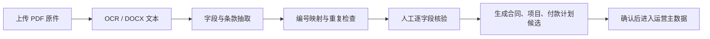

# 阶段3：重设计信息架构与任务流

> 日期：2026-07-15
> 目标：从“成熟经营看板假设”回到当前真实业务，建立可随数据成熟度演进的 Web 与移动信息架构。

## 一、Web 目标菜单树

```text
工作台
├─ 我的待办
├─ 数据概览
└─ 风险与到期

合同档案
├─ 合同台账
├─ 原件与附件
├─ 编号映射
└─ 条款与付款计划

项目履约
├─ 项目列表
├─ 阶段与成果
├─ 验收管理
└─ 变更与风险

客户应收
├─ 销项发票
├─ 客户回款
├─ 发票回款匹配
└─ 质保金与到期

供应商应付
├─ 供应商档案
├─ 采购/分包合同
├─ 进项发票
├─ 付款审批与付款
└─ 供应商交付与验收

数据核验
├─ 导入批次
├─ 字段核验
├─ 冲突与缺失
├─ 关系匹配
└─ 操作审计
```

当前阶段优先开放“合同档案、项目履约、客户应收、数据核验”；供应商应付仅展示真实已具备的关系和缺口，不伪造付款闭环。

## 二、页面优先级

| 优先级 | 页面 | 当前价值 |
|--------|------|----------|
| P0 | 合同档案工作台 | 汇总原件、编号、字段、来源、核验和下一动作 |
| P0 | 合同详情 | 用差异化模板呈现科研/服务/物资合同 |
| P0 | 数据核验中心 | 处理编号、金额、日期、语义和关系冲突 |
| P0 | 客户开票/回款匹配 | 分离客户应收事实与付款计划 |
| P1 | 项目履约详情 | 阶段、交付物、验收、风险和证据 |
| P1 | 供应商关系详情 | 从项目查看采购/分包、收票和付款缺口 |
| P1 | 移动任务 | 拍照上传、快速核验、进度/验收和轻审批 |
| P2 | 经营驾驶舱 | 只使用已核验数据形成管理汇总 |

## 三、核心任务流

### 3.1 新合同入库



成功标准：原件不可覆盖；每个采用值可回到原文；冲突不被静默消解。

### 3.2 合同履约与客户收款


科研合同允许多阶段合并触发付款；服务合同允许验收、资料归档、发票和时间条件组合。

### 3.3 供应商关联与应付


当前数据库只有供应商关系骨架，供应商付款为 0；页面必须以“待建立/待迁移”呈现，不使用成熟闭环示意冒充事实。

### 3.4 数据冲突处理

```text
导入批次 → 系统规则检测 → 生成问题 → 展示原值/候选值/来源 → 人工采用或驳回 → 留痕 → 重算受影响汇总
```

问题类型：编号冲突、单位冲突、日期异常、汇总/明细不一致、客户回款与供应商发票语义冲突、关系歧义、缺少原件或 OCR。

## 四、合同详情信息架构

```text
合同标题区：名称、canonical ID、SGSC/财务别名、双轴类型、数据时点
证据轨道：PDF → DOCX → 结构化抽取 → 人工核验
概览：主体、金额、税率、日期、服务范围、当前核验状态
条款与付款计划：原文条件、比例、质保金、推断/核验标识
项目履约：阶段、成果、验收、风险、附件
客户应收：销项发票、实际回款、匹配、质保金
供应商关系：采购/分包、供应商、进项票、付款事实或缺口
数据问题：冲突、缺失、规则命中和修订历史
```

不再显示没有公式的“履约健康度”或统一百分比。

## 五、移动信息架构

### 小程序

```text
今日
├─ 我的待办
├─ 到期提醒
└─ 快速审批

采集
├─ 拍合同/补充协议
├─ 拍验收材料
├─ 拍发票/回款/付款凭证
└─ 上传现场成果

项目
├─ 我负责的项目
├─ 阶段进度
├─ 交付与验收
└─ 风险与沟通

消息 / 我的
```

### App 增量能力

- 离线任务包与加密草稿。
- 批量、后台和断点续传。
- 完整现场验收、位置/时间/签名审计。
- 稳定推送与失败重试。

## 六、评审 Demo 映射

| Demo 屏 | 验证内容 |
|---------|----------|
| 档案总览 | 当前数据成熟度、合同双轴分类、待核验优先级、VxeGrid 兼容 |
| 合同详情 | 证据轨道、多编号、差异化条款、客户应收与供应商应付分轨 |
| 数据核验 | 原值/候选值/采用值、冲突处理和留痕 |
| 移动任务 | 小程序任务流、拍照/OCR、弱网与审批边界 |

## 七、视觉与交互验收

- 默认浅色，暗色只作为用户可选主题。
- 页面没有无来源的实时、已连接、健康分和自动匹配声明。
- 所有数字显示数据时点和来源层级。
- 推断、待核验、冲突、缺失与已核验有独立文字状态。
- 返回、筛选、页签和选中对象状态可恢复。
- 所有可见主按钮在 Demo 中有真实只读行为或明确标注“评审不可用”。
- 390px 下不依赖横向大表格完成核心任务。
