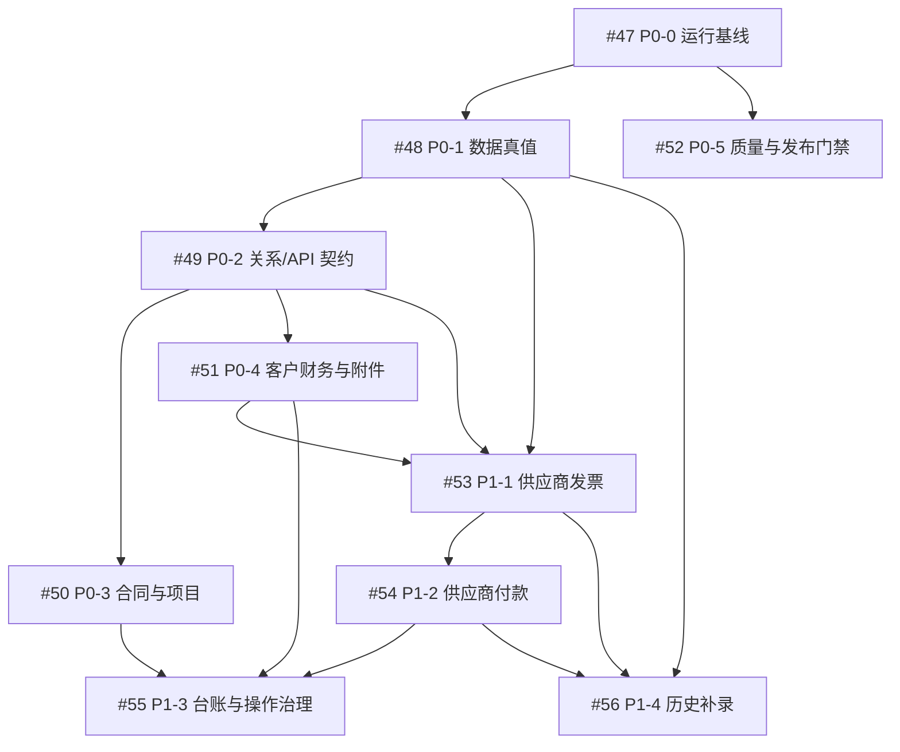

# 核心业务整改交接文档（2026-07-20）

> **交接状态：等待业务评审，尚未授权实施。**  
> **交接范围：合同、项目、客户财务、供应商财务、附件上传、操作闭环、台账体验、数据治理与发布门禁。**  
> **运行环境：本机 Docker 开发测试环境 `http://localhost:18090/web/`。**

---

## 1. 接手结论

本轮工作已完成“问题基线 → 正式整改主计划 → GitHub 任务化”的管理闭环；尚**未**开始业务代码修复、数据清洗、数据库写入或发布。

接手团队必须把该项目视为“数据真值 + 关系服务 + 页面闭环 + 发布证据”四层同步整改，而不是把问题拆成若干孤立页面美化任务。

### 当前可以做什么

- 只读审计、补充数据字段血缘、验证构建/容器版本、编写 dry-run 方案；
- 细化 P0-0、P0-1 的实施设计与验收脚本；
- 为 P0-2 至 P1-4 准备接口契约、测试设计和 UI 原型。

### 当前不能做什么

- 不得修改 `database/project_management.db` 中业务数据；
- 不得运行批量导入、清洗、回填、删除或迁移；
- 不得将未经业务确认的金额、ID 映射、付款计划、发票/回款关系视为真值；
- 不得停启、重建、清空共享基础设施容器；
- 不得在没有浏览器、API、构建产物三类证据时宣称修复完成。

---

## Git 环境清理快照

在本次正式交接准备前，已完成工作树和本地历史分支清理：仅保留当前工作树、与远端对齐的 `master`、当前 `codex/phase3-handoff` 分支，以及因仍有数据完整性独有提交而必须由 #48 审核的 `feature/phase2-foreign-key-enable`。

- [交接前 Git 环境清理记录](../audits/交接前Git环境清理记录-20260720.md)：删除依据、PR/补丁等价验证、保留分支和未提交文件边界。
- 禁止为了追求“干净”而删除 #48 尚未评估的外键/完整性候选提交，或执行 `git clean -fd` 清除未分类脚本。

---
## 2. 必读资料与阅读顺序

1. [核心业务整改主计划](../design/核心业务整改主计划-20260720.md)：整改范围、业务真值、P0/P1、Gate、验收案例的唯一计划来源。
2. [GitHub 总控 Epic #46](https://github.com/Samueljackson6/pm-director/issues/46)：子工作包状态、依赖与总控门禁。
3. [阶段 3 交接总览](./阶段3-交接总览-20260719.md)：已完成路由/菜单、详情拆分、领域边界和既有证据。
4. [阶段 3 风险与验证清单](./阶段3-风险与验证清单-20260719.md)：开始编码、发布前的验证约束。
5. [贡献约束](../贡献约束.md)：后端菜单唯一真值、金额单位、迁移与回滚要求。
6. [开发流程规范](../开发流程规范.md)：Issue、PR、CI、部署和验收顺序。
7. [部署规范](../部署规范.md)：Docker 构建、端口与本机/发布环境约束。

---

## 3. 已确认的问题基线

| 编号 | 已确认事实 | 影响 | 接手原则 |
|---|---|---|---|
| B-01 | 合同、项目、财务记录对同一业务对象存在金额口径冲突。 | 详情、看板、财务台账会显示互相矛盾的数据。 | 先定义唯一真值，禁止前端公式补丁。 |
| B-02 | 科技类项目付款计划、开票、回款、余额存在不完整/冲突风险。 | “付款进度”不能直接作为经营事实。 | 拆分计划、开票、回款、供应商应付并显式单位。 |
| B-03 | 合同详情接口已有阶段日期数据，但甘特图仍空白。 | 履约核心信息缺失。 | 优先排查前端 ECharts 生命周期、容器尺寸、响应式更新与构建版本。 |
| B-04 | 合同条款、保密条款位置早于履约、付款、交付信息。 | 科技合同信息层级错误。 | 移入页尾“附加信息”，不改条款事实。 |
| B-05 | 客户发票关联回款、客户回款关联发票缺少完整选择/提交/回显闭环。 | 点击无反应，账务关系无法维护。 | 以统一关系服务和上限校验完成闭环。 |
| B-06 | 多个编辑、新增、上传按钮为空白、占位或无效。 | 形成伪可用 UI。 | 每个可见操作必须完成、禁用或隐藏。 |
| B-07 | 上传出现“未知错误”和“内部服务器错误”双提示。 | 无法定位故障且用户体验差。 | 统一请求、错误码、单一提示、日志与附件落库。 |
| B-08 | 供应商发票没有有效入库记录，供应商付款为 0 条，新增依赖手输项目编号。 | 供应商应付链路未形成产品闭环。 | 按供应商→合同/项目→发票→付款重构。 |
| B-09 | 五类台账页都有重复大 Hero 横栏。 | 首屏信息密度低，筛选与主操作后移。 | 改为紧凑台账页头，Hero 仅用于概览。 |
| B-10 | 源码、构建产物、Docker 容器、浏览器可见版本的对应关系不稳定。 | “改了但没生效”不可判定。 | 先建立构建指纹和发布证据链。 |

---

## 4. GitHub 管理结构

### 4.1 里程碑与标签

- 里程碑：[核心业务整改（2026-07）](https://github.com/Samueljackson6/pm-director/milestone/5)
- 新增管理标签：`epic`、`data-governance`、`finance`、`supplier`、`release-gate`、`needs-business-confirmation`。
- 现有标签继续使用：`P0`、`P1`、`backend`、`frontend`、`testing`、`ci-cd`、`infra`、`docs`。

### 4.2 总控与工作包

| 层级 | Issue | 责任域 | 启动条件 | 关键交付 |
|---|---|---|---|---|
| 总控 | [#46 核心业务整改主计划](https://github.com/Samueljackson6/pm-director/issues/46) | 项目统筹与业务审批 | 已创建，待评审 | 子项状态、依赖、Gate、总体验收 |
| P0 | [#47 运行基线、备份与发布可追溯](https://github.com/Samueljackson6/pm-director/issues/47) | 发布/基础设施/测试 | 可立即开始 | 构建指纹、Docker 对应关系、备份与恢复验证 |
| P0 | [#48 数据真值、金额单位与关系契约](https://github.com/Samueljackson6/pm-director/issues/48) | 数据治理/财务 | 可只读开始；写入须审批 | 数据字典、真值确认单、dry-run、回滚设计 |
| P0 | [#49 核心关系服务与财务 API 契约](https://github.com/Samueljackson6/pm-director/issues/49) | 后端/API | #47/#48 确认后 | 统一 DTO、关系校验、错误码、契约测试 |
| P0 | [#50 合同与项目详情真实闭环](https://github.com/Samueljackson6/pm-director/issues/50) | 合同/项目前端 | #49 后 | 甘特图、编辑、条款层级、返回契约 |
| P0 | [#51 客户发票、回款与附件可靠闭环](https://github.com/Samueljackson6/pm-director/issues/51) | 客户财务前后端 | #48/#49 后 | 发票回款关联、附件上传、错误闭环 |
| P0 | [#52 质量门禁、回归测试与受控发布](https://github.com/Samueljackson6/pm-director/issues/52) | QA/CI/CD | #47 起贯穿 | CI、Playwright、发布/回滚证据 |
| P1 | [#53 供应商发票业务闭环重构](https://github.com/Samueljackson6/pm-director/issues/53) | 供应商财务 | #48/#49/#51 后 | 自动补全、发票、附件与状态 |
| P1 | [#54 供应商付款业务闭环重构](https://github.com/Samueljackson6/pm-director/issues/54) | 供应商财务 | #53/#49/#51 后 | 发票选择、部分付款、凭证与追溯 |
| P1 | [#55 台账列表体验与操作覆盖治理](https://github.com/Samueljackson6/pm-director/issues/55) | 前端体验 | #50/#51/#53/#54 后 | 紧凑页头、操作覆盖清单 |
| P1 | [#56 历史数据补录与持续数据质量机制](https://github.com/Samueljackson6/pm-director/issues/56) | 数据治理 | #48/#53/#54 + 审批后 | 分批补录、待核验队列、质量报告 |

### 4.3 既有 Issue 复用

| 既有 Issue | 关系 | 处理方式 |
|---|---|---|
| [#10 前端 Docker 构建/根除 stale-dist](https://github.com/Samueljackson6/pm-director/issues/10) | P0-0 子范围 | 由 #47 统一验收；不重复实现。 |
| [#13 SQLite 备份策略与恢复验证](https://github.com/Samueljackson6/pm-director/issues/13) | P0-0 子范围 | 由 #47 统一验收；不重复实现。 |

---

## 5. 依赖图与执行顺序

### 建议并行方式

1. **第一并行组：** #47 和 #48 的只读审计/dry-run 设计可同时开始。
2. **第二并行组：** #49 可提前讨论 DTO 和测试样例，但正式落地必须等待 #48 的业务真值确认。
3. **第三并行组：** #50 可先诊断甘特图渲染；#51 可先诊断上传网络链路；两者不得自行定义财务计算规则。
4. **第四并行组：** #53/#54 仅在供应商模型、关系服务和附件规范稳定后实施。
5. **收口：** #52 对所有 P0 变更进行回归和发布把关；P0 未关闭前不得发布 P1 供应商闭环。

---

## 6. Gate 与停工条件

### Gate 0：业务确认

以下未确认，禁止进入数据写入或正式财务计算实现：

- 合同—项目是一对一、一对多或多对多；
- 金额单位与字段命名；
- `finance_records`、`current_finance_view`、发票、回款的权威/派生关系；
- 历史“客户回款”类发票的保留与迁移策略；
- 供应商历史发票/付款的可信来源；
- 可自动修复与必须人工确认的数据范围。

### Gate 1：数据安全

- 已执行数据库备份并校验；
- 迁移仅允许先运行 `--dry-run`；
- dry-run 产出候选变更、异常、拒绝原因和回滚步骤；
- 业务负责人逐批确认；
- 写入后复核记录数、金额汇总、关系完整性和样本合同。

### Gate 2：代码与 PR

- 一个 PR 仅覆盖一个工作包或同一紧密契约；
- 不绕过 Vben 后端菜单和返回契约；
- 迁移包含测试、dry-run 和回滚文档；
- 通过后端、前端、E2E、数据完整性相关检查；
- 不在 CI 未完成、评论未解决、业务确认未取得时合并。

### Gate 3：Docker 发布

- 记录 Git SHA、前端构建产物 hash、容器内资产 hash 与后端健康状态；
- 真实浏览器在 `http://localhost:18090/web/` 完成烟测；
- 无未解释的 4xx/5xx、`pageerror`、`requestfailed`、控制台错误；
- 发布记录、备份、回滚步骤和验收截图进入 `docs/audits/`。

### Gate 4：业务验收

- P0 的 AC-01 至 AC-10 全部有自动化或人工证据；
- 涉及金额/关系/附件丢失或超额关联时，立即停止后续批次并按批次回滚；
- 未通过 Gate 4 不得宣称 P0 完成。

---

## 7. 接手后的首批行动清单

### 第一天：只读与基线

- [ ] 在 #47 回填当前 Git SHA、Docker 容器状态、前端 `index.html`/关键资产哈希和 `/ready` 响应；
- [ ] 审计 #10、#13 的当前实现，明确复用、补齐或关闭路径；
- [ ] 在 #48 建立字段血缘表和金额差异样本，不做写入；
- [ ] 在 #52 建立 P0 AC-01 至 AC-10 测试矩阵与证据目录；
- [ ] 将每项发现回写对应 Issue，而不是只保留在聊天记录。

### 第二步：等待/取得业务确认

- [ ] 使用 #48 的“必须先确认的业务决策”清单发起业务评审；
- [ ] 将已确认、不确定、拒绝自动修复的数据分类写入 Issue 与数据真值确认单；
- [ ] 未获确认的记录只标记为“待核验”，不改成 0、已匹配或已完成。

### 第三步：进入实现

- [ ] #49 先冻结 API DTO 和关系校验测试；
- [ ] #50/#51 基于已冻结契约各自建立小 PR；
- [ ] #52 在每个 PR 合并前验收构建、浏览器、网络和数据影响；
- [ ] P1 仅在所有 P0 Gate 通过后排期。

---

## 8. 验收证据要求

每个 Issue 关闭前至少要回填以下内容：

1. 关联 PR 与变更文件范围；
2. 执行的测试命令和结果摘要；
3. 浏览器截图或录屏路径；
4. API 请求/响应摘要（不得包含 Token、Cookie、认证头或敏感附件内容）；
5. 数据影响：只读、dry-run、写入批次或“无数据写入”；
6. 发布构建 SHA、容器资产校验、回滚准备情况；
7. 未解决风险和后续 Issue。

针对数据写入型 Issue，额外必须具备：备份校验、dry-run 输出、业务确认、变更清单、写入后统计、抽样对账和回滚记录。

---

## 9. 关键技术边界

- **路由：** 本项目使用 Vben `accessMode: 'backend'`；后端菜单定义是业务路由唯一真值，前端模块仅作 Legacy 兼容。
- **金额：** 所有 API/字段/页面必须明确元或万元；未知值与已知零值必须区分。
- **合同来源：** PDF 合同影像是源头真值；DOCX 是 OCR 文本层；`cache/contracts/*.json` 是中间结构化产物，不能替代合同全文。
- **数据写入：** 不允许在运行态读取 API 的同时触发隐式建业务表或静默清洗；写入必须进入受控迁移。
- **上传：** 附件必须具备类型/大小校验、一次错误提示、安全日志、成功刷新和下载验证。
- **基础设施：** 仅操作 pm-director 自身容器，禁止破坏共享数据库/缓存基础设施。

---

## 10. 文档维护

- 本文件是 2026-07-20 的交接快照；业务规则以主计划和对应 GitHub Issue 的最新确认记录为准。
- 新增决策、数据真值变更、Gate 例外必须回写到 [主计划](../design/核心业务整改主计划-20260720.md) 与 #46。
- 各工作包完成后，在 `docs/audits/` 保存可复现证据，并更新本目录 README 的状态说明。
- 不得将 `.workbuddy/`、本地数据库备份、测试上传附件或含敏感信息的日志作为 GitHub 交付材料。

---

## 修订记录

| 日期 | 版本 | 说明 | 状态 |
|---|---|---|---|
| 2026-07-20 | v1.0 | 创建整改 Epic、P0/P1 Issues、里程碑、标签后的正式交接文档 | 待业务评审 |