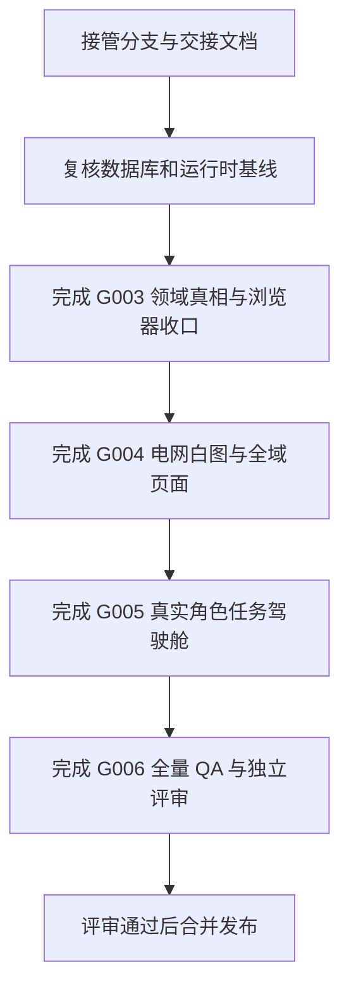

# 阶段 3 实施进度与后续任务

## 1. 接手顺序



禁止跳过 G003 直接美化驾驶舱，否则会把仍在迁移中的错误财务语义继续放大。

## 2. G002：菜单与路由真相（已完成）

### 已完成

- 四个一级任务域及其子页面已经进入后端动态菜单。
- 项目台账、项目详情、供应商收票和供应商付款拥有正式路由。
- 清理项目错误重定向和供应商详情自重定向。
- 建立 `business-navigation.ts`，统一安全来源、详情参数和返回上下文。
- 客户回款详情返回可恢复列表页 Query、筛选、分页和页码。
- 修复 Vben 服务端菜单绝对子路由生成错误。

### 已有证据

- 后端、应用和工具层共 16 项自动化通过。
- 生产构建 11/11 通过。
- 真实浏览器 8 条任务流通过，业务 HTTP 错误、`pageerror` 和 `requestfailed` 为 0。
- 证据入口：`docs/audits/阶段3浏览器验收-20260718.md`。

## 3. G003：详情拆分与领域真相（已完成）

### 已完成

- 合同、客户发票、供应商三个超长详情页已先建立特征测试，再拆为编排页和职责组件。
- 合同详情相关 6 个测试文件共 25 项曾通过。
- 供应商后端聚合只读取真实供应商发票语义，并返回 `supplier_invoices` 与 `data_states`。
- 供应商领域后端聚焦测试 4 项通过。
- 客户发票编辑金额完成“万元展示 → 元 API”转换，并限制为客户销项范围。
- 客户发票未知金额、未知状态、领域冲突、来源缺失和只读加载均有测试保护。
- 2026-07-19 最新聚焦结果：客户发票 18 项通过，供应商详情 13 项通过。
- 交接回归共 65 项通过：后端 9、Vben 应用 54、菜单工具 2。
- `pnpm --filter @vben/web-antd run build` 已完成并生成 2026-07-19 的新 `dist` 产物。

### 收口结果（2026-07-19）

1. `get_local_qcc_data()` 已移除读取路径的建表与提交行为；供应商详情和 QCC 缓存读取均受严格只读连接保护。
2. 客户回款列表/详情已覆盖全量汇总、空值/负值待核验、异常 SQL 传播及连接关闭。
3. 供应商收票与付款页面已补齐“数据源未建立”“已知零”“待核验”状态；收票与付款关联单据均排除历史客户回款。
4. G003 后端回归 `23 passed`，Vben 应用回归 `53 passed`，生产构建成功。
5. 真实浏览器已登录验证供应商收票、供应商付款的读取请求、渲染和无写请求；此前合同、客户发票、客户回款、供应商详情的交接浏览器证据仍有效。
6. 测试、浏览器核验和生产构建前后，业务数据库 SHA256、大小与 mtime 均与接管基线一致。
7. 全仓 `vue-tsc` 的 511 条既有错误仍需由 G006 建立模块化债务基线，不影响本 G003 完成判定。

完整证据见：`docs/audits/stage3-g003-domain-truth-closure-20260719.md`。

### G003 完成门

- 三个详情拆分前后请求、事件、可用操作和 `StateBlock` 行为等价。
- 客户应收与供应商应付严格分轨；金额单位和零/空语义一致。
- 浏览器网络中页面加载无 POST/PATCH/DELETE/自动匹配请求。
- 数据库哈希、大小、mtime 或等价记录级证据证明零变更。

## 4. G004：Vben 视觉基础与全域页面（未开始）

### 任务包

1. 将“电网白图”语义 Token 映射到现有 Vben 主题变量。
2. 统一 `Page + 查询表单 + VxeGrid + StateBlock + Modal/Drawer` 页面模板。
3. 重设计合同、项目、客户发票、客户回款、供应商、供应商收票和供应商付款的列表与详情。
4. 移除整屏灰色渐变的第二层应用壳、大块深色区域和无业务意义的卡片墙。
5. 保留金额、状态、期限、来源和主动作，在 390/768 宽度使用任务卡或关键列策略。
6. 完成键盘焦点、触控尺寸、对比度、图表摘要和 reduced-motion。

### 完成门

- 所有核心页面使用真实 Vben 组件契约和统一浅色视觉。
- 1440/1024/768/390 四视口主流程无页面级横向滚动。
- 视觉改造不改变分页、筛选、权限和写入语义。

## 5. G005：角色任务驾驶舱（已完成）

### 已完成

1. 正式驾驶舱移除了对 `phase3-review` 和 `review=phase3` 的条件依赖；评审 Demo 仍作为独立评审资产保留。
2. 单一正式路由提供综合、经营、项目、财务、数据核验五个决策视角。
3. 综合首屏固定为任务/缺口、风险/到期、数据可信度、角色摘要、最近变化。
4. 驾驶舱接口新增 `task_actions`、`risk_actions`、`verification_actions`、`data_contract`、`recent_changes`；每个动作带对象 ID、原因、期限、责任人、状态与真实详情下钻 Query。
5. 指标契约统一返回口径、来源、覆盖范围、核验状态、数据截止时间；当前镜像数据不伪装为实时或已核验。
6. 视角切换只更新当前 URL Query，不重复请求聚合接口；正式动作下钻到真实详情路由。

### 已有证据

- 后端聚焦测试 5 项通过。
- 前端接口、正式驾驶舱源码边界及评审 Demo 回归共 8 项通过。
- 生产构建通过（既有动态导入与大分块警告列入 G006 性能治理）。
- 真实浏览器覆盖五视角、下钻、单次聚合、无 `pageerror` / `requestfailed` / 业务 HTTP 错误。
- 数据库哈希验证前后一致：`45353085257E5EE93CBD98889911631B7A793D51474559C6DBCA5EB6859C7C64`。
- 证据入口：`docs/audits/stage3-g005-real-dashboard-20260719.md`。
## 6. G006：全量 QA 与最终评审（业务范围完成）
### 完成结果（2026-07-19）

- 后端回归 `39 passed`；前端全量 Vitest `60 files / 379 tests passed`；生产构建通过。
- 最终浏览器 QA 已覆盖 17 条核心业务任务、32 条四视口检查、驾驶舱 6 项检查和状态恢复 6 项检查，全部通过。
- 浏览器业务范围 axe 固定审计唯一 `.pm-workbench-page` 根节点；合同、项目、客户发票、供应商、驾驶舱均无 Critical / Serious。
- 页面加载、下钻和状态验证无业务 API 写请求；数据库 SHA-256 验证前后一致：`45353085257E5EE93CBD98889911631B7A793D51474559C6DBCA5EB6859C7C64`。
- 已处理合同/项目选择框 ARIA、VxeTable 可聚焦滚动区、驾驶舱/发票页对比度和状态读屏语义。
- 证据：`docs/audits/stage3-g006-final-qa-20260719.md`、`docs/audits/assets/stage3-g006-final-browser.json`。

### 静态边界收口复验（2026-07-19）

- 合同、客户应收、供应链、项目、驾驶舱及相关 API 的 TypeScript 错误已归零；全仓 `vue-tsc` 仍有 **354 项**跨模块存量错误，不能关闭全仓类型门禁。
- 合同台账查询按钮补充 `aria-label="查询"`，消除 Ant Design Vue 字间距导致的 Playwright 可访问名称不稳定；复跑后合同详情与返回恢复通过。
- 本轮复验：后端 39 passed、Vitest 60 files / 379 tests passed、生产构建通过、浏览器 G006 通过；数据库哈希仍为 `45353085257E5EE93CBD98889911631B7A793D51474559C6DBCA5EB6859C7C64`。
- `.turbo` 已从 Prettier 扫描中排除；不忽略业务源码。受影响业务文件的无缓存 ESLint 仍为 **1360 errors / 7 warnings** 历史格式/排序债务，因此全仓 Lint 尚未关闭。

### 保留技术债

- `pnpm -F @vben/web-antd run typecheck` 的最新全仓基线为 354 项跨模块错误；阶段 3 改造域为 0 项，未宣称全仓通过。
- `.turbo` 已从 Prettier 缓存扫描中排除；无缓存 ESLint 对本轮涉及业务文件仍报 1360 errors / 7 warnings，根 `pnpm lint` 与全仓 Lint 均未关闭。
- 构建仍有 Ant Design Vue 动静态导入和大 chunk 警告；Vben 全局壳层的图标按钮、嵌套交互和标签壳对比度应在独立框架层无障碍任务处理。
- 独立 reviewer 服务在 2026-07-19 返回 503，未得到可用的独立审批结论；不得表述为已获无条件批准。

### 验收矩阵

| 维度 | 最低要求 |
|------|----------|
| 自动化 | 后端测试、应用 Vitest、工具 Vitest、类型检查、Lint、生产构建全部通过 |
| 浏览器 | 四组菜单和全部核心任务在 1440/1024/768/390 可完成 |
| 状态 | 加载、空、错误、无权限占位、弱网、缺失、冲突、陈旧数据均可解释和恢复 |
| 无障碍 | axe 无 Critical/Serious；键盘、焦点、触控、对比度、reduced-motion 合格 |
| 网络 | 无未处理 `pageerror`、`requestfailed`、业务 4xx/5xx、隐式写请求或双跳 |
| 数据 | 数据库零变更；无自动匹配或未授权更新 |
| 评审 | 独立 reviewer 对业务、Vben、视觉、安全、无障碍和回归无条件批准 |

## 7. 建议团队分工

| 工作流 | 责任范围 | 合并条件 |
|--------|----------|----------|
| 领域真值 | G003 后端契约、金额/方向/状态和只读边界 | 前后端聚焦测试 + 浏览器网络证据 |
| 设计系统 | Token、Page/Grid/Form/StateBlock 模板和无障碍 | 组件契约测试 + 四视口基线 |
| 业务页面 | 按合同、客户应收、供应链纵向切片实施 | 每个切片独立回归后再合并 |
| 驾驶舱 | 五视角、可解释指标、真实下钻 | API 口径和目标页 Query 同时完成 |
| QA/评审 | 构建、浏览器、axe、性能、DB 和独立审查 | 所有 blocker 清零 |

不同工作流不得同时编辑同一核心编排页；按纵向切片建立小 PR，保留每次 RED/GREEN 和浏览器证据。

## 8. 推荐验证命令

源码扫描型 Vitest 必须使用 Node 环境：

```powershell
cd ui-vben
pnpm exec vitest run --environment node apps/web-antd/src/views/customer-finance/invoices/__tests__
pnpm exec vitest run --environment node apps/web-antd/src/views/suppliers/detail/__tests__
```

后端和生产构建按项目现有环境执行：

```powershell
python -m pytest backend/tests/test_auth_menu_ia.py backend/tests/test_supplier_detail_domain_truth.py backend/tests/test_suppliers.py -q
cd ui-vben
pnpm run build:antd
```

最终命令和结果必须记录到 `docs/audits/`，不能只在聊天或本地终端中保留。

## 2026-07-19 G003 收口更新

- 供应商详情 GET 与 QCC 缓存读取已严格只读；缺表不触发建表。
- 客户回款、供应商收票和付款的零值、待核验与领域边界已覆盖测试。
- 后端 23 passed；Vben 13 files passed, 53 tests passed；生产构建通过。
- 真实浏览器验证供应商收票与付款读取接口、页面渲染和无写请求。
- 业务数据库 SHA256、大小与 mtime 与接管基线一致。
- 证据：docs/audits/stage3-g003-domain-truth-closure-20260719.md`n
