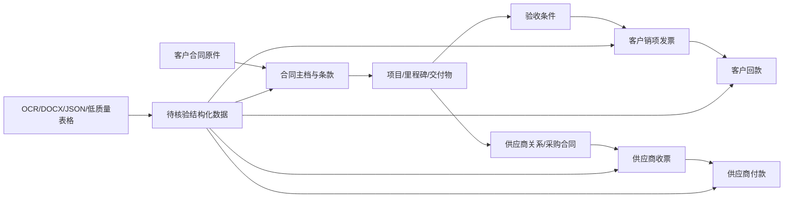

# 阶段 3 设计与业务基线

## 1. 用户与决策视角

| 角色 | 进入系统首先要回答的问题 | 主要动作 |
|------|--------------------------|----------|
| 项目总监/管理层 | 哪些合同、项目、回款和供应商事项需要立即决策 | 看任务缺口、风险、到期、可信度并下钻 |
| 项目经理 | 当前里程碑、交付物、验收和付款条件卡在哪里 | 更新计划、补证据、发起协同 |
| 财务 | 客户应收、销项发票、回款，以及供应商收票、付款分别处于什么状态 | 核对、匹配预览、确认、跟进 |
| 合同管理员 | 原合同、编号、条款、变更、交付和付款条件是否完整可追溯 | 归档、抽取、核验、纠错 |
| 数据核验人员 | 哪些字段来自 OCR/表格，哪些冲突或缺失 | 对照原件、确认来源、修正映射 |

## 2. 核心业务关系

客户应收和供应商应付是两条方向相反、通过项目或合同关系连接的资金链，必须严格分轨。



关键约束：

- 科研类合同通常围绕研究阶段、考核目标、专利/论文/软著和专家评审组织履约。
- 服务类合同通常围绕服务期、报告/数据交付、验收、质保金和多种分期付款方式组织履约。
- 合同法律/交易模板和项目执行形态应是两条分类轴，不能用单一“合同类型”覆盖全部语义。
- 付款计划不是客户实际回款，也不是供应商实际付款。
- 客户回款曾同时存在于 `receipts` 和历史 `invoices(客户回款)`，必须标识双模型和部分匹配状态。
- `direction=inbound` 不能单独证明是供应商发票；还必须满足明确的业务类型和来源契约。

## 3. 数据真值与演进阶段

### 当前真值分层

| 层级 | 数据 | 使用规则 |
|------|------|----------|
| 源头真值 | 合同 PDF 扫描件及签署原件 | 条款、权利义务、违约、付款条件必须可回溯原文 |
| 文本派生层 | 人工 OCR 后 DOCX | 用于条款检索和抽取，不替代原件 |
| 结构化中间层 | `cache/contracts/*.json`、OCR 结果 | 必须带来源、批次、置信度和核验状态 |
| 运营数据层 | Excel/飞书等表格 | 数据质量不稳定；汇总、日期、金额和状态需差异核对 |
| 系统记录层 | SQLite 业务表 | 当前是镜像和增强层，不应默认全部已核验 |
| 人工确认层 | 经责任人确认的纠错和映射 | 保留确认人、时间、依据和原值 |

### 演进路线

1. 现阶段：合同原件和表格主导，系统承担聚合、核验、提醒和可追溯展示。
2. 过渡阶段：逐步建立编号映射、来源批次、数据质量队列和受控确认流程。
3. 成熟阶段：系统成为结构化主数据入口，外部表格降级为交换/导入格式，关键写入具备审批与审计。

禁止为了呈现“系统成熟度”而伪造实时、已匹配、已核验、健康度、同比或自动化能力。

## 4. 当前信息架构

```text
经营工作台
└─ 经营与任务驾驶舱

合同履约
├─ 合同台账
└─ 项目台账

客户应收
├─ 销项发票
└─ 客户回款

供应链
├─ 供应商档案
├─ 供应商收票
└─ 供应商付款
```

详情页是相应业务组的隐藏子路由。旧 URL 仅通过单向兼容跳转保留，不得形成自重定向、双跳或返回陌生页面。

## 5. 页面与交互原则

- 列表负责发现、筛选和进入对象；详情负责解释对象事实、关系、证据和下一步。
- 驾驶舱先展示任务与缺口，再展示风险、数据可信度、角色摘要和最近变化。
- 每个指标至少说明值、状态、截止时间、来源、覆盖范围、核验状态、解释和动作。
- 未知、缺失、冲突、历史快照、数据源未建立必须是不同状态，不能统一显示 `0` 或 `-`。
- 自动匹配只能先预览后确认；缺少安全后端契约时必须禁用并解释。
- 写操作使用 Modal/Drawer 和显式确认；首屏加载、路由变化和详情读取不得隐式写库。

## 6. 视觉方向：电网白图

当前有效视觉方向为浅色、克制、信息密度高的“电网白图”：

- 主背景以云雾白、浅灰和纸张白为主，禁止大块深色底和通用霓虹模板。
- 文字采用墨色层级，品牌强调使用少量电光蓝和青绿色。
- 科技感来自细网格、技术线、等宽编号、数据时点、履约轨道和短时反馈，不来自持续粒子或全屏脉冲。
- 履约链可以成为合同详情的唯一强视觉中心，其他卡片保持辅助层级。
- 控制卡片数量，优先用分区、描边、留白、表格和时间线建立结构。
- 动效服务于状态变化、下钻和上下文保持；必须支持 `prefers-reduced-motion`。

详细 Token、字号、间距、状态色、可访问性和性能预算以 [UI 设计规范](../UI设计规范.md) 为准。

## 7. Vben 兼容边界

- 主产品唯一实施入口：`ui-vben/apps/web-antd`。
- 页面壳使用 Vben `Page`，列表优先 `useVbenVxeGrid`，状态统一使用 `StateBlock`。
- 表单、Modal、Drawer、VxeTable 和 ECharts 必须通过项目现有适配层和本地官方示例实现。
- 请求统一使用 `requestClient`，动态菜单组件路径、后端菜单和前端路由必须同步。
- 可以使用 Ant Design Vue 的 Card、Descriptions、Tabs、Timeline、Steps 等内容组件，但不得另造一套应用壳或绕开 Vben 主题体系。
- 每次修改前按项目规则检查现有正确写法、代码图谱和本地 Vben 官方文档。

## 8. Web、小程序与 App 边界

| 端 | 主要场景 | 本阶段边界 |
|----|----------|------------|
| 桌面 Web | 全量管理、批量核验、复杂关系、报表和配置 | 阶段 3 的生产实施主体 |
| 小程序 | 待办、拍照上传、轻审批、现场确认、提醒 | 只定义任务/API 边界，不复制桌面菜单 |
| App | 更强的现场采集、离线缓存、消息和设备能力 | 后续独立设计，不由当前 Vben 页面直接推导 |

三端共享合同、项目、供应商、发票、收付款、证据和核验状态等领域对象；布局、导航和交互按端侧场景分别设计。
