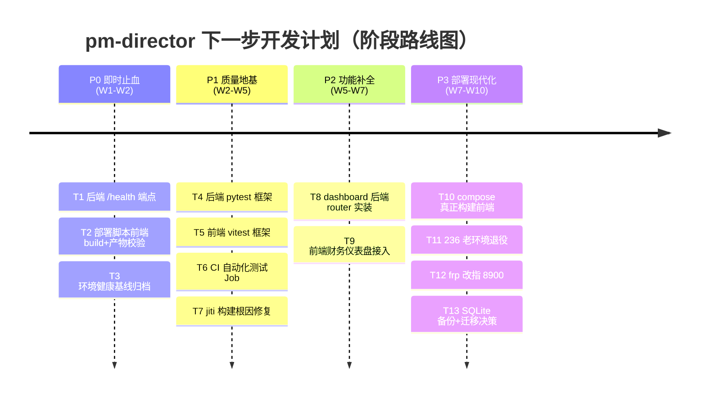

# pm-director 下一步开发计划

> 文档版本：v1.0 ｜ 创建日期：2026-07-07 ｜ 作者：许清楚（产品经理）
> 关联依据：CI/部署端口已修正（`5777/` → `8900/web/`）；Docker 环境 QA 正式验证 **9 PASS / 0 FAIL / 1 WARN**；已知 8 项技术债与风险（见正文）。

---

## 0. 目标与原则

本计划围绕四条核心原则展开，作为所有任务取舍的准绳：

| 原则 | 含义 | 对应动作 |
|------|------|----------|
| **巩固 Docker 化** | 让"全 Docker"成为唯一可信部署路径，环境可一键复现 | 端口统一、构建内联、验证固化 |
| **补齐测试** | 从"零自动化测试"到"提交即验证"，降低回归风险 | 后端 pytest + 前端 vitest + CI 用例门禁 |
| **偿还技术债** | 逐项消弭 8 项已知风险，尤其是 stale-dist 与 jiti 构建脆弱性 | 健康端点、compose 真正构建前端、构建根因修复 |
| **平滑退役老环境** | 在不影响业务前提下下线 236 老路径，统一到全 Docker | 停 systemd、改 frp、移除 ruoyi-office-vben 依赖 |

**非目标（本期不做）**：MySQL 强制迁移（仅做决策与备份策略）；新业务功能开发（本期聚焦地基与债，功能以 dashboard 补全为限）；Redis/缓存接入。

---

## 1. 阶段路线图总览

四阶段递进：**先止血**（稳定可重复部署）→ **打地基**（测试 + 构建根因）→ **补功能**（dashboard）→ **现代化**（根除 stale-dist + 退役老环境 + 数据决策）。

**阶段依赖**
- P1 依赖 P0 环境稳定（验证可信）。
- P3-T10 依赖 P1-T7（jiti 修复后才能在 docker 内可靠构建前端）。
- P3 整体依赖 P0/P1 完成；T11 与 T12 须协同（避免公网指向已停服务）。

---

## 2. 详细任务清单

**图例**
- 任务优先级：`P0`=阻断性/安全相关必须做，`P1`=应做（质量关键），`P2`=可选/增强
- 工作量：`S`=≤1 人日，`M`=1–3 人日，`L`=3–5 人日
- 角色：工程师（software-engineer）/ QA（software-qa-engineer）/ 架构师 / 产品经理（许清楚）

### 阶段 P0 — 即时止血（W1–W2）

| ID | 任务 | 描述 | 优先级 | 角色 | 验收标准 | 工作量 |
|----|------|------|--------|------|----------|--------|
| T1 | 后端补 /health 轻量端点 | 在 FastAPI 增加 `GET /health`（或 `/api/health`），返回 200 + 基础状态，替代当前仅靠 `/api/stats` 探活 | P0 | 工程师 | ① 端点返回 200 JSON；② compose healthcheck 可配置该端点；③ 不依赖 DB 查询即可返回（纯存活探针） | S |
| T2 | 部署脚本/CI 增加前端 build + 产物校验 | 在 `scripts/deploy-docker.sh` 与 `.github/workflows/ci.yml` 增加前端构建（`pnpm build`）与 dist 产物存在性/体积校验，避免 stale-dist 翻车 | P0 | 工程师（QA 验证） | ① 部署前自动 build 前端；② 校验 `ui-vben/apps/web-antd/dist/index.html` 等关键产物存在且 mtime 新鲜；③ 缺失则部署失败并告警 | M |
| T3 | 固化并归档 Docker 环境健康基线 | 将 QA 的 9 PASS/0 FAIL/1 WARN 验证结果固化为基线文档 + 复跑脚本，作为后续回归参照 | P1 | QA + 产品经理 | ① 输出《Docker 环境健康基线》文档；② 提供一键复跑脚本；③ 明确 1 个 WARN 的处置结论（接受/跟进） | S |

### 阶段 P1 — 质量地基（W2–W5）

| ID | 任务 | 描述 | 优先级 | 角色 | 验收标准 | 工作量 |
|----|------|------|--------|------|----------|--------|
| T4 | 后端 pytest 测试框架与核心用例 | 引入 pytest，覆盖 contracts/finance/invoices 等核心 router 的关键接口与异常路径 | P1 | 工程师 | ① pytest 配置就绪可本地运行；② 核心接口（≥合同/财务/开票）有冒烟用例；③ 覆盖率基线记录 | M |
| T5 | 前端 vitest 测试框架与关键用例 | 引入 vitest，覆盖财务/合同等关键页面组件与路由渲染 | P1 | 工程师 | ① vitest 配置就绪；② 关键组件/页面有渲染与交互用例；③ 可本地运行 | M |
| T6 | CI 接入自动化测试 Job | 在 `ci.yml` 增加 pytest + vitest 执行 Job，门禁失败则阻断合并 | P1 | 工程师（QA 协作） | ① CI 跑通测试 Job；② 测试失败即红；③ lint 与测试分离清晰 | M |
| T7 | jiti 构建缺陷根因评估与修复 | 定位 Vite7 + `@vben/vite-config` 将 jiti 内联进浏览器 bundle 导致 SPA 登录页渲染异常的根因，评估升级 vite-config / 锁定 jiti 版本 / 替换方案 | P1 | 工程师 + 架构师 | ① 复现并定位根因；② 选定方案（升级/锁版本/补丁）；③ `pnpm build` 产物登录页可正常渲染（不再依赖预构建 dist 绕过） | L |

### 阶段 P2 — 功能补全（W5–W7）

| ID | 任务 | 描述 | 优先级 | 角色 | 验收标准 | 工作量 |
|----|------|------|--------|------|----------|--------|
| T8 | dashboard 后端 router 实装 | 实装当前空占位的 dashboard router，提供财务/合同/进度聚合接口（金额汇总、回款率、阶段分布等） | P1 | 工程师（产品经理给口径） | ① dashboard router 有真实查询逻辑；② 提供聚合接口契约（字段/口径经 PM 确认）；③ 返回结构可被前端消费 | M |
| T9 | 前端财务仪表盘接入 dashboard 接口 | 前端财务仪表盘页面接入 T8 接口，完成联调与展示 | P1 | 工程师（产品经理验收） | ① 仪表盘数据来自 dashboard 接口；② 关键指标展示正确；③ 空/异常数据有兜底 | M |

### 阶段 P3 — 部署现代化（W7–W10）

| ID | 任务 | 描述 | 优先级 | 角色 | 验收标准 | 工作量 |
|----|------|------|--------|------|----------|--------|
| T10 | docker compose 真正构建前端（根除 stale-dist） | 修改 `docker-compose.yml` 让 frontend 用 `Dockerfile.frontend` 多阶段构建（依赖 T7 jiti 修复），使 `docker compose build` 真正产出前端镜像，消除宿主机 dist 卷依赖 | P0 | 工程师 + 架构师 | ① `docker compose build` 重建 frontend 镜像；② 不再依赖宿主机 dist 卷；③ 全新部署无 stale-dist 风险 | M |
| T11 | 236 老环境退役 | 停止 systemd --user 的 pm-backend/pm-frontend，移除对外部 ruoyi-office-vben 的依赖，下线 `scripts/deploy-236.sh`，确认全 Docker 接管 | P1 | 工程师 + 架构师 | ① 老 systemd 服务已停且禁用；② ruoyi-office-vben 不再被引用；③ 老脚本标记废弃或删除；④ 业务验证无中断 | M |
| T12 | frp 公网穿透改指 8900 | 将 frp 公网 `15777→236:5777` 改为 `→236:8900` 且路径 `/web/`，使公网访问指向全 Docker 前端 | P1 | 工程师 / 架构师 | ① 公网 `15777` 命中 236:8900/web/；② 老 5777 路径不再对外；③ 访问验证通过 | S |
| T13 | SQLite 备份策略 + MySQL 迁移决策 | 落地 SQLite 定时备份 + 恢复校验脚本；就 MySQL 迁移给出明确决策（执行迁移 / 维持 SQLite 并强化备份） | P1 | 产品经理 + 架构师（工程师落地） | ① 备份脚本按周期运行且可恢复验证；② 输出《数据库架构决策》结论文档（含迁移或不迁移的理由与备份 SLA） | M |

---

## 3. 风险与依赖

### 3.1 关键依赖（上下游）

| 依赖 | 说明 | 影响 |
|------|------|------|
| T7 → T10 | jiti 根因修复是 compose 真正构建前端的前提 | T7 未闭环则 T10 无法根除 stale-dist |
| P0 → P1/P3 | 环境稳定（T1/T2）是测试与现代化基础 | P0 未完成会导致后续验证不可信 |
| T8 → T9 | dashboard 后端接口是前端仪表盘前置 | T8 未交付则 T9 无数据 |
| T11 → T12 | 老环境退役与 frp 改指应协同 | 顺序错会导致公网中断 |

### 3.2 主要风险

| 风险 | 等级 | 缓解 | 负责 |
|------|------|------|------|
| jiti 根因涉及上游 Vite7/jiti，可能无干净修复 | 高 | T7 预留"锁定 jiti 版本 + `Dockerfile.frontend` 补丁"兜底（已知 `Dockerfile.frontend` 已处理 jiti 内联） | 工程师 + 架构师 |
| stale-dist 在 T10 前仍可能翻车 | 中 | T2 在 CI/部署脚本强制 build + 校验作为过渡防护 | 工程师 |
| 老环境退役导致业务中断 | 中 | T11/T12 先做全 Docker 验证（QA 基线）再切换 frp，灰度切流 | 工程师 + QA |
| SQLite 无备份，单点损坏即数据丢失 | 高 | T13 优先落地备份（即使不迁移 MySQL）；迁移决策可后置 | 产品经理 + 工程师 |
| 测试体系建设占用主干，短期拖慢功能 | 低 | P1 与 P2 错峰，T4/T5 先冒烟后扩展 | 产品经理排期 |

---

## 4. 里程碑时间建议（相对周次，不写死日期）

以"本周"为 W0，给出相对周次锚点（供排期参考，可按实际产能前移/后移）：

| 里程碑 | 相对周次 | 达成标志 |
|--------|----------|----------|
| **M0 部署可重复** | W2 末 | T1/T2 完成，T3 基线归档；CI/部署脚本已含前端 build 校验 |
| **M1 测试门禁就绪** | W5 末 | T4–T6 完成，CI 跑通 pytest+vitest，主干合并有测试守护 |
| **M2 jiti 根因闭环** | W5–W6 | T7 完成，`pnpm build` 登录页正常，不再依赖预构建 dist 绕过 |
| **M3 dashboard 上线** | W7 末 | T8/T9 完成，财务仪表盘有真实数据接口 |
| **M4 全 Docker 硬化** | W9 末 | T10 完成，compose 真正构建前端，stale-dist 根除 |
| **M5 老环境退役 + 数据决策** | W10 末 | T11–T13 完成，公网改指 8900，老路径下线，备份/迁移决策落定 |

整体节奏：P0（2 周）→ P1（3 周，与 P0 末段重叠）→ P2（2 周）→ P3（3 周，T10 紧接 T7）。合计约 10 周，可按人力并行压缩。

---

## 5. 度量与验收总览

- **部署可靠性**：stale-dist 事故数 = 0（T2/T10 后）；`docker compose build` 一次成功构建前端。
- **可观测性**：后端健康探针从"靠 `/api/stats`"升级为专用 `/health`。
- **测试覆盖**：后端/前端核心路径有冒烟用例；CI 测试 Job 绿为合并门禁。
- **环境一致性**：公网访问唯一指向 `8900/web/`；老 `5777` 路径下线。
- **数据安全**：SQLite 具备可验证备份；数据库架构有明确决策文档。
